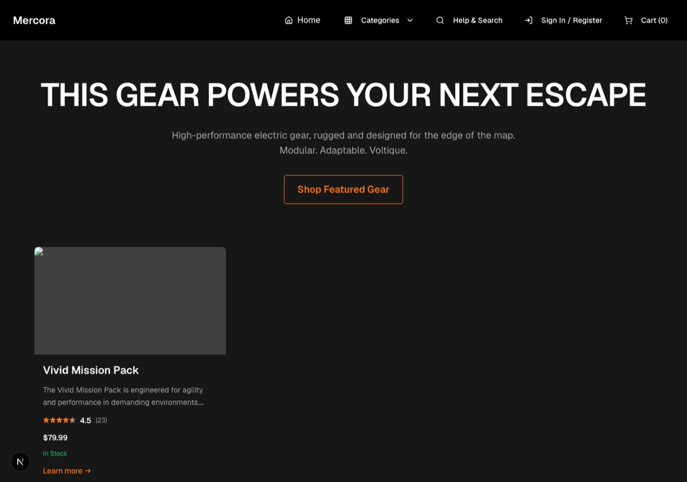
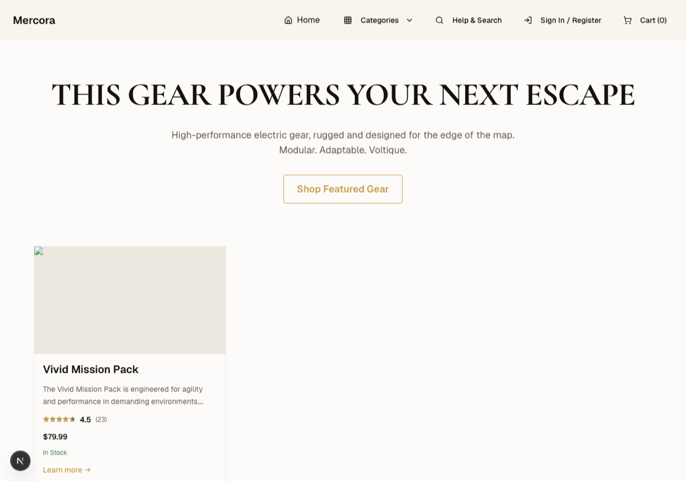
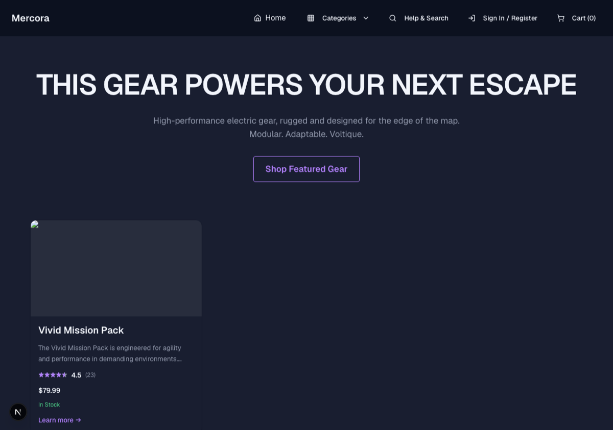
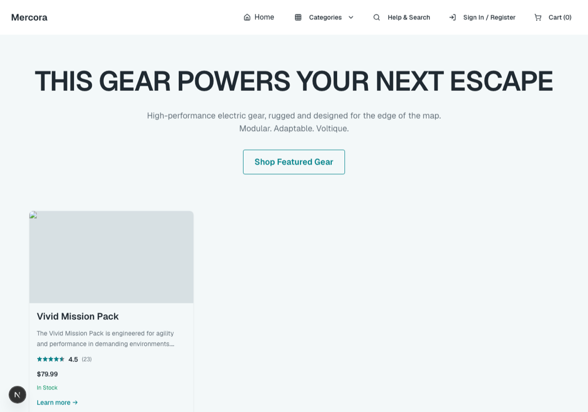
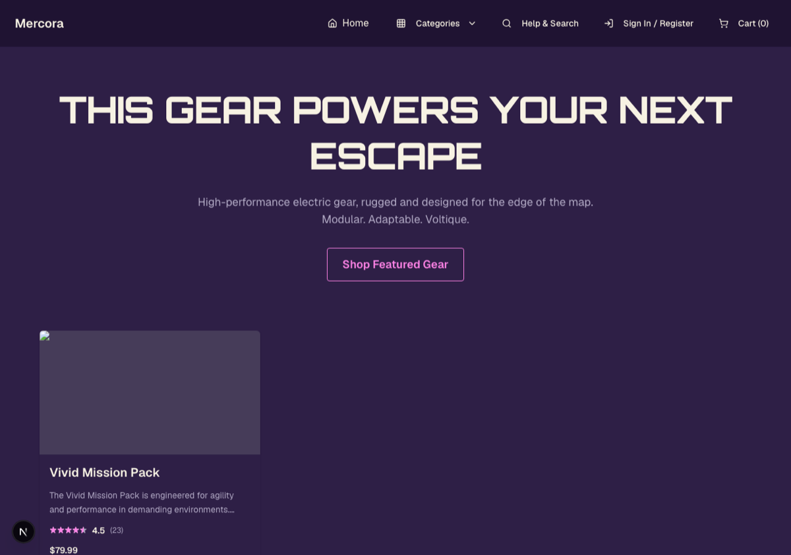
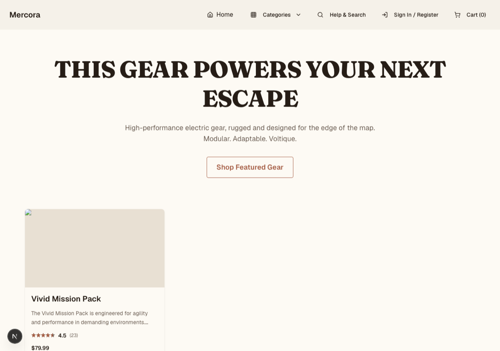
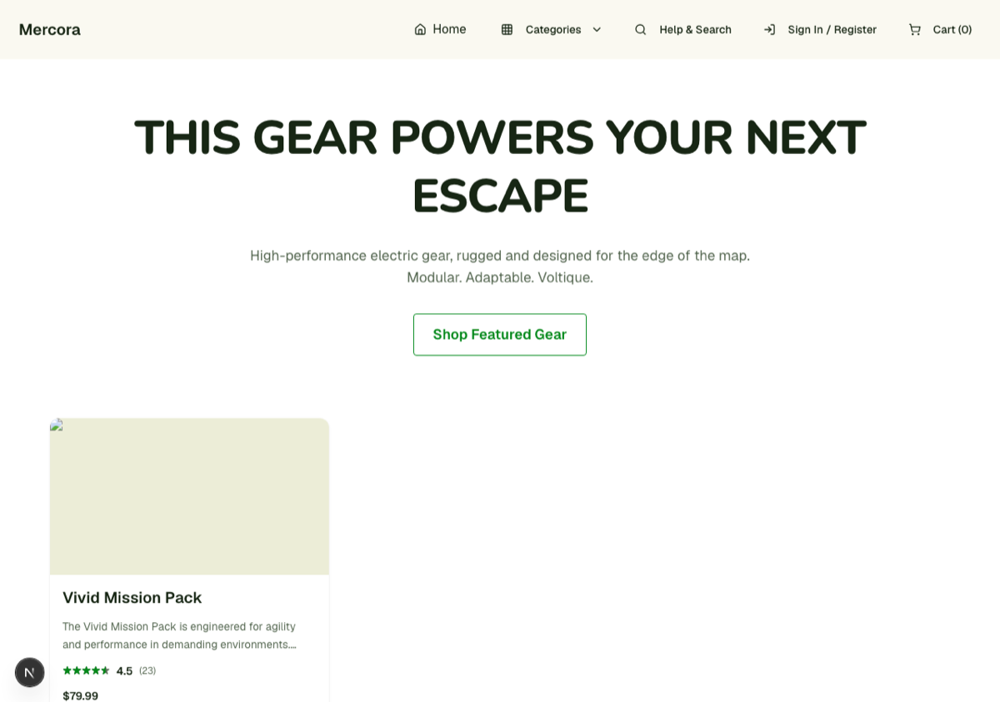

# Mercora

Mercora is a themeable reference storefront on Cloudflare — Next.js on Workers, D1, R2, Vectorize,
Workers AI, Clerk, and Stripe — built to render any catalogue. The outdoor-gear catalogue shipped in
this repository is sample data, not the product; the default look is one of seven presets the
storefront can render, chosen by an admin without touching component code.

## Quick start

1. Clone the repository and enter it:
   ```bash
   git clone https://github.com/russellkmoore/mercora.git && cd mercora
   ```
2. Install the pinned Node version:
   ```bash
   mise install
   ```
3. Install dependencies:
   ```bash
   npm install
   ```
4. Create `.dev.vars` in the repo root (never committed) with at least these five keys, values from
   your Stripe and Clerk dashboards — names only below, no values:
   - `NEXT_PUBLIC_CLERK_PUBLISHABLE_KEY`
   - `CLERK_SECRET_KEY`
   - `NEXT_PUBLIC_STRIPE_PUBLISHABLE_KEY`
   - `STRIPE_SECRET_KEY`
   - `STRIPE_WEBHOOK_SECRET`
5. Start the dev server:
   ```bash
   npm run dev
   ```
   This runs a `predev` hook automatically: it builds the theme CSS and applies local D1 migrations
   and the development seed. There is no separate seed step.

Prefer to have a coding assistant do this for you? Hand it [AGENTS.md](AGENTS.md) and ask it to set
the project up end to end.

## Themes and layouts

Every row below is copied verbatim from that theme file's header comment in `themes/`.

| Preset | Industry | Synopsis |
|---|---|---|
| Volt Dark (default) | outdoor & technical gear | The store's original look — high-contrast black, electric-orange accent, built for gear that gets used hard. |
| Luxe | fashion, jewelry, watches, fragrance | A small luxury house that wants the site to feel like a printed lookbook — ivory paper, a single champagne-gold accent, serif headlines. |
| Midnight | consumer electronics, audio, gaming peripherals | For shoppers who compare specs before they buy — indigo-black surfaces, a violet accent, a polished, cinematic feel. |
| Clinical | skincare, wellness, supplements, pharmacy, dental | Trustworthy and regulated — pure white surfaces, cool graphite text, one sea-teal accent, and a lot of air. Reads like a well-designed pharmacy label. |
| Retro | vintage clothing, record stores, arcade & collectibles, nostalgia brands | Deep purple, magenta and cyan with cream text — loud on purpose but legible; the joke is in the decoration, not the contrast. |
| Atelier | furniture, ceramics, home goods, handmade & small-batch | Warm linen surfaces, a clay accent, a sage secondary, and soft serif headlines — feels like a maker's studio page. |
| Market | grocery, specialty food, coffee, farm boxes | Bright, dense and friendly — off-white surfaces, forest-green text, a produce-green accent, and big radius rounded sans. Feels like a good neighborhood grocer's app. |

The same default layout, one home page, all seven presets:

   
  

Three independent layout switches, members and defaults copied verbatim from `lib/layout/variants.ts`:

| Switch | Members | Default |
|---|---|---|
| Category grid density | `grid-3`, `grid-2`, `list` | `grid-3` |
| Home hero style | `full-bleed`, `split`, `minimal` | `minimal` |
| Product gallery position | `left`, `top` | `left` |

All four appearance choices — the preset and the three layout switches — are set from the admin.
Switching between shipped presets needs no deploy. There is one deployment and seven looks, not seven
demo sites. See [docs/theming.md](docs/theming.md) for the token contract and switching mechanism.

## Architecture at a glance

```
Browser
  └─▶ Next.js Worker (OpenNext on Cloudflare Workers)
        ├─▶ D1 database (binding: DB) — products, orders, appearance, subscriptions, gift cards
        ├─▶ R2 buckets (bindings: MEDIA, NEXT_INC_CACHE_R2_BUCKET) — product, category and CMS media
        ├─▶ Vectorize index (binding: VECTORIZE) — semantic product and knowledge search
        ├─▶ Workers AI (binding: AI) — Volt chat and embeddings
        ├─▶ Analytics Engine (binding: WEB_VITALS) — observability
        ├─▶ Clerk — authentication and admin role
        ├─▶ Stripe — payments, tax, webhooks, subscriptions
        └─▶ Email Sending (binding: EMAIL) — transactional email
```

An external AI agent can shop through the same pricing and checkout-finalization path the storefront
itself uses, over an authenticated HTTP API. See
[docs/mcp-server-specification.md](docs/mcp-server-specification.md) for the tool schema and
authentication.

## Documentation

The full index is [docs/README.md](docs/README.md). The most useful entries, grouped the same way:

**Setup** — [AGENTS.md](AGENTS.md) (assistant-led setup), [docs/DEPLOYMENT_SETUP.md](docs/DEPLOYMENT_SETUP.md),
[docs/runtime-configuration.md](docs/runtime-configuration.md), [docs/theming.md](docs/theming.md)

**Architecture** — [docs/architecture.md](docs/architecture.md), [docs/ai-pipeline.md](docs/ai-pipeline.md),
[docs/mcp-server-specification.md](docs/mcp-server-specification.md), [docs/observability.md](docs/observability.md)

**Operations** — [docs/admin-authentication.md](docs/admin-authentication.md),
[docs/customer-communications.md](docs/customer-communications.md),
[docs/dependency-security.md](docs/dependency-security.md), [docs/shopify-migration.md](docs/shopify-migration.md)

**Reference** — the locked ADRs ([checkout](docs/checkout-trust-boundary.md),
[webhooks/refunds](docs/webhooks-refunds-inventory.md), [migrations](docs/database-migrations.md),
[subscriptions](docs/subscriptions.md)), [docs/CLAUDE.md](docs/CLAUDE.md) (AI-assistant context)

## Contributing and gates

See [CONTRIBUTING.md](CONTRIBUTING.md) for the full list of validation commands to run before a
commit. CI runs a superset of that list on every push and pull request. Report security issues
privately per [SECURITY.md](SECURITY.md).

## License

MIT — see [LICENSE](LICENSE). Copyright (c) 2025-present Russell K. Moore and Mercora contributors.
