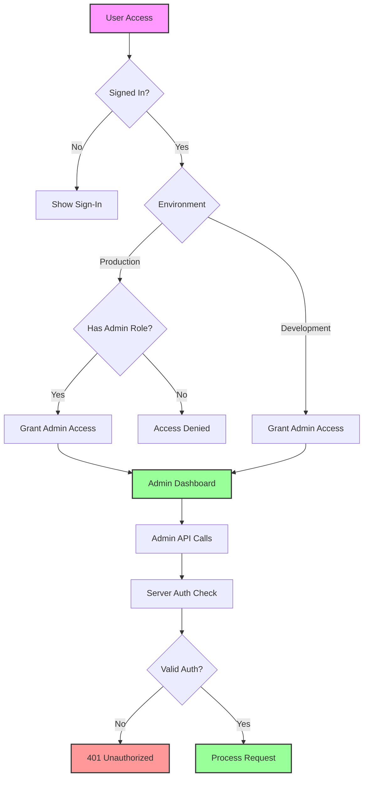

# 🔐 Admin Authentication System

> **Comprehensive multi-layered authentication system securing admin routes and APIs with role-based access control**

Mercora implements a robust admin authentication system that protects all admin functionality through multiple security layers, ensuring only authorized users can access administrative features.

## 🏗️ Architecture Overview



## 🔒 Security Layers

### 1. **Client-Side Route Protection**
- **Component**: `AdminGuard` wrapper for all admin pages
- **Location**: `/app/admin/layout.tsx`
- **Function**: Prevents unauthorized users from seeing admin interface

### 2. **Server-Side API Protection**
- **Middleware**: `checkAdminPermissions()` function
- **Location**: `/lib/auth/admin-middleware.ts`
- **Function**: Validates all admin API requests

### 3. **Role-Based Access Control**
- **Development**: Any authenticated user gets admin access
- **Production**: Only users with admin role or whitelisted user IDs

## 📋 Implementation Details

### AdminGuard Component

```tsx
// Wraps all admin pages with authentication protection
<AdminGuard>
  <AdminDashboard />
</AdminGuard>
```

**Features:**
- ✅ **Loading States**: Shows loading while checking authentication
- ✅ **Error Handling**: Graceful fallback for unauthorized access
- ✅ **Sign-In Integration**: Direct integration with Clerk authentication
- ✅ **Access Denied UI**: Clear messaging for authenticated non-admin users

### Admin Middleware

```typescript
// Server-side authentication for all admin APIs
const authResult = await checkAdminPermissions(request);
if (!authResult.success) {
  return NextResponse.json({ error: authResult.error }, { status: 401 });
}
```

**Authentication Methods:**
- ✅ **Clerk Integration**: Uses `auth()` for user session validation
- ✅ **Token Authentication**: Supports API tokens for server-to-server calls
- ✅ **Dev Bypass**: Special development bypass for testing
- ✅ **Role Checking**: Validates admin role or user ID whitelist

## 🛡️ Security Features

### Environment-Based Access Control

#### Development Environment
```typescript
if (process.env.NODE_ENV === "development") {
  // Any authenticated user becomes admin for easier development
  console.log(`✅ DEV MODE: User ${userId} granted admin access`);
  return { success: true, userId };
}
```

#### Production Environment
```typescript
// Check for admin role in Clerk metadata
const userRole = (sessionClaims as any)?.metadata?.role;
const adminUsers = process.env.ADMIN_USER_IDS?.split(",") || [];

if (userRole === "admin" || adminUsers.includes(userId)) {
  return { success: true, userId };
}
```

### API Token Authentication

For server-to-server admin API calls:

```bash
# Using environment token
curl -H "Authorization: Bearer $ADMIN_VECTORIZE_TOKEN" \
     https://app.com/api/admin/analytics
```

## 🔧 Configuration

### Environment Variables

| Variable | Purpose | Required | Example |
|----------|---------|----------|---------|
| `NODE_ENV` | Environment mode | Yes | `development` or `production` |
| `ADMIN_USER_IDS` | Production admin user IDs | Production | `user_123,user_456` |
| `ADMIN_VECTORIZE_TOKEN` | API token for server calls | Optional | `secret-token-123` |

### Clerk Configuration

#### Development Setup
1. Any authenticated user automatically gets admin access
2. No additional configuration required

#### Production Setup
1. Set `ADMIN_USER_IDS` environment variable with comma-separated user IDs
2. Alternatively, use Clerk's public metadata to set user roles:

```javascript
// In Clerk Dashboard, set user public metadata:
{
  "role": "admin"
}
```

## 🎯 User Experience

### Admin Access Flow

1. **Unauthenticated User**:
   - Sees sign-in prompt with clear call-to-action
   - Can sign in directly from the admin route

2. **Authenticated Non-Admin**:
   - Sees access denied message with helpful explanation
   - Provided option to return to main site

3. **Authenticated Admin**:
   - Immediate access to admin dashboard
   - Admin menu item appears in user dropdown
   - Seamless experience across all admin features

### Admin Menu Integration

```tsx
// Admin menu item in user dropdown (ClerkLogin component)
{!adminLoading && isAdmin && (
  <UserButton.Link
    label="Admin Dashboard"
    labelIcon={<Shield />}
    href="/admin"
  />
)}
```

## 🔍 Testing Authentication

### Manual Testing

1. **Unauthenticated Access**:
   ```bash
   curl https://app.com/admin
   # Should redirect to sign-in
   ```

2. **API Without Auth**:
   ```bash
   curl -X POST https://app.com/api/admin/analytics
   # Returns: {"error":"Authentication required. Please sign in."}
   ```

3. **Valid API Token**:
   ```bash
   curl -H "Authorization: Bearer $ADMIN_TOKEN" \
        https://app.com/api/admin/analytics
   # Returns: Valid analytics data
   ```

### Development Testing

Use development bypass token for testing:

```bash
# Add dev parameter to bypass auth in development
curl "https://localhost:3000/api/admin/analytics?dev=mercora-dev-bypass"
```

## 🚨 Security Considerations

### Best Practices Implemented

✅ **Defense in Depth**: Multiple security layers (client + server)
✅ **Least Privilege**: Production requires explicit admin role assignment
✅ **Secure Defaults**: Denies access by default, grants only when authorized
✅ **Environment Separation**: Different behavior for dev vs production
✅ **Token Security**: API tokens stored as secure environment variables
✅ **Error Handling**: Graceful degradation with helpful error messages

### Security Warnings

⚠️ **Development Mode**: Any authenticated user gets admin access for easier development
⚠️ **Production Setup**: Ensure `ADMIN_USER_IDS` is properly configured before production deployment
⚠️ **Token Management**: Keep API tokens secure and rotate regularly
⚠️ **Clerk Configuration**: Verify Clerk public metadata roles are properly set

## 📊 Access Control Matrix

| User Type | Development | Production | Admin APIs | Admin UI |
|-----------|------------|------------|------------|----------|
| **Unauthenticated** | ❌ Denied | ❌ Denied | ❌ Denied | ❌ Denied |
| **Authenticated User** | ✅ Granted | ❌ Denied | ❌ Denied | ❌ Denied |
| **Admin User** | ✅ Granted | ✅ Granted | ✅ Granted | ✅ Granted |
| **API Token** | ✅ Granted | ✅ Granted | ✅ Granted | N/A |

## 🔄 Migration from Previous System

The system was upgraded from a development-only authentication to a production-ready solution:

### Before (Development Only)
```typescript
// Authentication completely disabled
console.log("⚠️ WARNING: Admin authentication is DISABLED for development");
return { success: true, userId: "dev-admin" };
```

### After (Production Ready)
```typescript
// Multi-layered authentication with proper role checking
const authResult = await checkAdminPermissions(request);
if (!authResult.success) {
  return NextResponse.json({ error: authResult.error }, { status: 401 });
}
```

## 🚀 Future Enhancements

### Planned Features
- **Permission Levels**: Granular permissions beyond admin/non-admin
- **Audit Logging**: Track admin actions for compliance
- **Session Management**: Advanced session controls and timeouts  
- **Two-Factor Authentication**: Additional security layer for admin access
- **Admin Invitation System**: Streamlined process for adding new admin users

### Integration Opportunities
- **RBAC System**: Role-based access control with fine-grained permissions
- **SSO Integration**: Corporate single sign-on for enterprise deployments
- **Admin Activity Dashboard**: Real-time monitoring of admin user actions

---

## 📝 Summary

The Mercora admin authentication system provides enterprise-grade security through:

- **🔐 Multi-layered Protection**: Client-side and server-side authentication
- **🎯 Environment-Aware**: Different behavior for development and production
- **🛡️ Role-Based Access**: Granular control over admin permissions
- **⚡ Developer-Friendly**: Easy development workflow with bypass options
- **🚀 Production-Ready**: Secure defaults with comprehensive error handling

The system ensures that only authorized users can access admin functionality while maintaining an excellent developer experience and user interface.

---

**Need help with admin authentication? Check the [development context](CLAUDE.md) for additional technical details.**