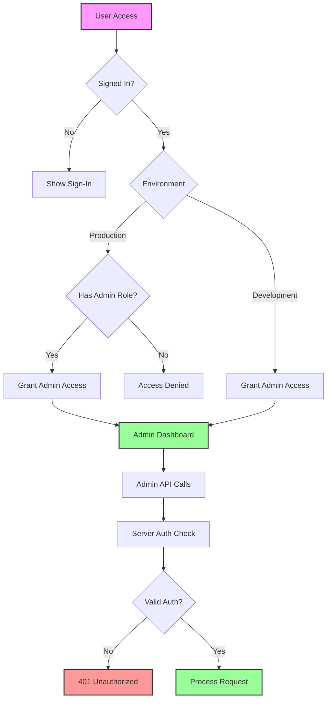

# Admin authentication

Multi-layered authentication protects every admin route and API endpoint with role-based access
control.

**Status:** Active

## Architecture overview


```mermaid
graph TB
    A[User Access] --> B{Signed In?}
    B -->|No| C[Show Sign-In]
    B -->|Yes| D{Environment}
    %%.
    D -->|Development| E[Grant Admin Access]
    D -->|Production| F{Has Admin Role?}
    %%.
    F -->|No| G[Access Denied]
    F -->|Yes| H[Grant Admin Access]

    %%.
    H --> I[Admin Dashboard]
    E --> I

    %%.
    I --> J[Admin API Calls]
    J --> K[Server Auth Check]
    %%.
    K --> L{Valid Auth?}
    L -->|No| M[401 Unauthorized]
    L -->|Yes| N[Process Request]

    %%.
    style A fill:#f9f,stroke:#333,stroke-width:2px
    style I fill:#9f9,stroke:#333,stroke-width:2px
    %%.
    style M fill:#f99,stroke:#333,stroke-width:2px
    style N fill:#9f9,stroke:#333,stroke-width:2px
```

Every admin request passes through this flow before reaching a route or an API handler.

## Security layers

### 1. Client-side route protection
- **Component**: `AdminGuard` wrapper for all admin pages
- **Location**: `/app/admin/layout.tsx`
- **Function**: Prevents unauthorized users from seeing the admin interface

### 2. Server-side API protection
- **Middleware**: `checkAdminPermissions()` function
- **Location**: `/lib/auth/admin-middleware.ts`
- **Function**: Validates all admin API requests

### 3. Role-based access control
- **Development**: Any authenticated user gets admin access
- **Production**: Only users with the Clerk admin role or an active `adminUsers` table row

## Implementation details

### AdminGuard component

```tsx
// Wraps all admin pages with authentication protection
<AdminGuard>
  <AdminDashboard />
</AdminGuard>
```

AdminGuard wraps every admin page and checks authentication before rendering it.

**Features:**
- **Loading states**: Shows a loading indicator while checking authentication
- **Error handling**: Falls back gracefully for unauthorized access
- **Sign-in integration**: Integrates directly with Clerk authentication
- **Access denied UI**: Shows a clear message to authenticated non-admin users

### Admin middleware

```typescript
// Server-side authentication for all admin APIs.
const authResult = await checkAdminPermissions(request);
if (!authResult.success) {
  return NextResponse.json({ error: authResult.error }, { status: 401 });
}
```

This middleware runs before any admin API route executes its own logic.

**Authentication methods:**
- **Clerk integration**: Uses `auth()` for user session validation
- **Token authentication**: Supports API tokens for server-to-server calls
- **Dev bypass**: A development-only bypass for testing
- **Role checking**: Validates the Clerk admin role or an active `adminUsers` table row

## Security features

### Environment-based access control

#### Development environment
```typescript
if (process.env.NODE_ENV === "development") {
  // Any authenticated user becomes admin for easier development.
  console.log(`✅ DEV MODE: User ${userId} granted admin access`);
  return { success: true, userId };
}
```

In development, any authenticated user immediately becomes an admin.

#### Production environment
```typescript
// lib/auth/admin-middleware.ts:64-77 — the real production check.
const isAdmin = await isUserAdmin(userId); // lib/models/admin.ts, adminUsers table

if (isAdmin) {
  return { success: true, userId };
}

// Fallback: Clerk metadata role, for backward compatibility.
const userRole = (sessionClaims as any)?.metadata?.role;
if (userRole === "admin") {
  return { success: true, userId };
}
```

In production, only a confirmed admin or a Clerk role passes.

### API token authentication

Use an environment token for server-to-server admin API calls:

```bash
# Using environment token
curl -H "Authorization: Bearer $ADMIN_VECTORIZE_TOKEN" \
     https://app.com/api/admin/analytics
```

## Configuration

### Environment variables

| Variable | Purpose | Required | Example |
|----------|---------|----------|---------|
| `NODE_ENV` | Environment mode | Yes | `development` or `production` |
| `ADMIN_VECTORIZE_TOKEN` | API token for server calls | Optional | `secret-token-123` |

The production admin list lives in the `adminUsers` D1 table, managed through `/admin/users`. No environment variable configures it.

### Clerk configuration

#### Development setup
1. Any authenticated user automatically gets admin access.
2. No additional configuration is required.

#### Production setup
1. Add an active row to the `adminUsers` D1 table for the user (managed through `/admin/users`).
2. Or set the role in Clerk's public metadata:

```javascript
// In Clerk Dashboard, set user public metadata:
{
  "role": "admin"
}
```

Either path grants the same production admin access.

## User experience

### Admin access flow

1. **Unauthenticated user** — sees a sign-in prompt and can sign in directly from the admin route.
2. **Authenticated non-admin** — sees an access-denied message with an explanation, and an option to return to the main site.
3. **Authenticated admin** — gets immediate access to the admin dashboard; the admin menu item appears in the user dropdown.

### Admin menu integration

```tsx
// Admin menu item in user dropdown (ClerkLogin component).
{!adminLoading && isAdmin && (
  <UserButton.Link
    label="Admin Dashboard"
    labelIcon={<Shield />}
    href="/admin"
  />
)}
```

This menu item only renders once `isAdmin` resolves to true.

## Testing authentication

### Manual testing

1. **Unauthenticated access**:
   ```bash
   curl https://app.com/admin
   # Should redirect to sign-in
   ```

2. **API Without Auth**:
   ```bash
   curl -X POST https://app.com/api/admin/analytics
   # Returns: {"error":"Authentication required. Please sign in."}
   ```

3. **Valid API Token**:
   ```bash
   curl -H "Authorization: Bearer $ADMIN_TOKEN" \
        https://app.com/api/admin/analytics
   # Returns: Valid analytics data
   ```

A valid token returns real analytics data instead of an error.

### Development testing

Use the development bypass header for testing.

```bash
curl -H "x-dev-admin: <value defined in lib/auth/admin-middleware.ts>" \
     "https://localhost:3000/api/admin/analytics"
```

The bypass value is a fixed literal in source, not an environment variable. There is no `DEV_ADMIN_BYPASS_TOKEN` to set. This header is honored only when `NODE_ENV` is `development`. It is inert in every deployed build.

## Deployment safety

A deployed Worker running a development build must never open the dev-only admin bypasses. `assertDeploymentPosture()` in `lib/auth/deployment-guard.ts` guards against exactly this. It runs before every credential check in both `checkAdminPermissions` (`lib/auth/admin-middleware.ts`) and `authenticateRequest` (`lib/auth/unified-auth.ts`), and before the admin short-circuit in `middleware.ts`.

- **What trips it:** the Worker is running the Cloudflare Workers runtime (`navigator.userAgent === "Cloudflare-Workers"`) and the build's `NODE_ENV` resolves to `development`. This can only happen when a development build is deployed by mistake — local development (`next dev`, vitest) never matches.
- **What the operator sees:** HTTP 503 with the fixed message `Service temporarily unavailable.` on `/admin` and `/api/admin` routes, and one `auth.deployment_guard_tripped` event in the `commerce.telemetry.v1` stream at critical severity, escalated by the observability tail worker. The public storefront keeps serving normally — the guard is scoped to admin paths only.
- **How to recover:** build and deploy with a production `NODE_ENV` and redeploy. No secret, setting, or database change is involved.

On the first deploy after this guard ships, confirm it is live rather than silently inert. A
correct production deploy should serve admin routes normally, while a deliberately-misbuilt
development deploy should return 503 on `/admin` and `/api/admin`. This check exists because the
interaction between the Workers `navigator` global and the `nodejs_compat` flag inside the
OpenNext bundle could not be verified from documentation alone.

**Residual status-code difference:** the guard's 503 reaches the wire for the 31 routes under
`app/api/admin/` (via the `middleware.ts` branch above). Six callers of `checkAdminPermissions`
outside that prefix — `app/api/agent-chat`, `app/api/categories`, `app/api/categories/[id]`,
`app/api/products`, `app/api/products/[id]`, `app/api/promotions` — hardcode `{ status: 401 }`
and will surface 401 instead. They still fail closed, which is the security property; only the
status code differs.

## Security considerations

### Best practices implemented

- **Defense in depth**: Multiple security layers (client and server)
- **Least privilege**: Production requires an explicit admin role assignment
- **Secure defaults**: Denies access by default, grants only when authorized
- **Environment separation**: Different behavior for development and production
- **Token security**: API tokens are stored as secure environment variables
- **Error handling**: Fails gracefully with helpful error messages

### Security warnings

- **Development mode**: Any authenticated user gets admin access, for easier development.
- **Production setup**: Production admin access requires either an active `adminUsers` row or the Clerk metadata role; neither is granted by default.
- **Token management**: Keep API tokens secure and rotate them regularly.
- **Clerk configuration**: Verify Clerk public metadata roles are set correctly.

## Access control matrix

| User Type | Development | Production | Admin APIs | Admin UI |
|-----------|------------|------------|------------|----------|
| **Unauthenticated** | Denied | Denied | Denied | Denied |
| **Authenticated User** | Granted | Denied | Denied | Denied |
| **Admin User** | Granted | Granted | Granted | Granted |
| **API Token** | Granted | Granted | Granted | N/A |

## Migration from the previous system

The system was upgraded from a development-only authentication to a production-ready solution.

### Before: development only

The superseded implementation short-circuited the permission check entirely and returned a synthetic admin identity for every request.

### After: production ready (current)
```typescript
// Multi-layered authentication with proper role checking.
const authResult = await checkAdminPermissions(request);
if (!authResult.success) {
  return NextResponse.json({ error: authResult.error }, { status: 401 });
}
```

The system now runs with full production authentication for all admin functions.

## Future enhancements

### Planned features
- **Permission levels**: Granular permissions beyond admin/non-admin
- **Audit logging**: Track admin actions for compliance
- **Session management**: Advanced session controls and timeouts
- **Two-factor authentication**: An additional security layer for admin access
- **Admin invitation system**: A streamlined process for adding new admin users

### Integration opportunities
- **RBAC system**: Role-based access control with fine-grained permissions
- **SSO integration**: Corporate single sign-on for enterprise deployments
- **Admin activity dashboard**: Real-time monitoring of admin user actions

---

See [docs/CLAUDE.md](CLAUDE.md) for more development context on admin authentication.
