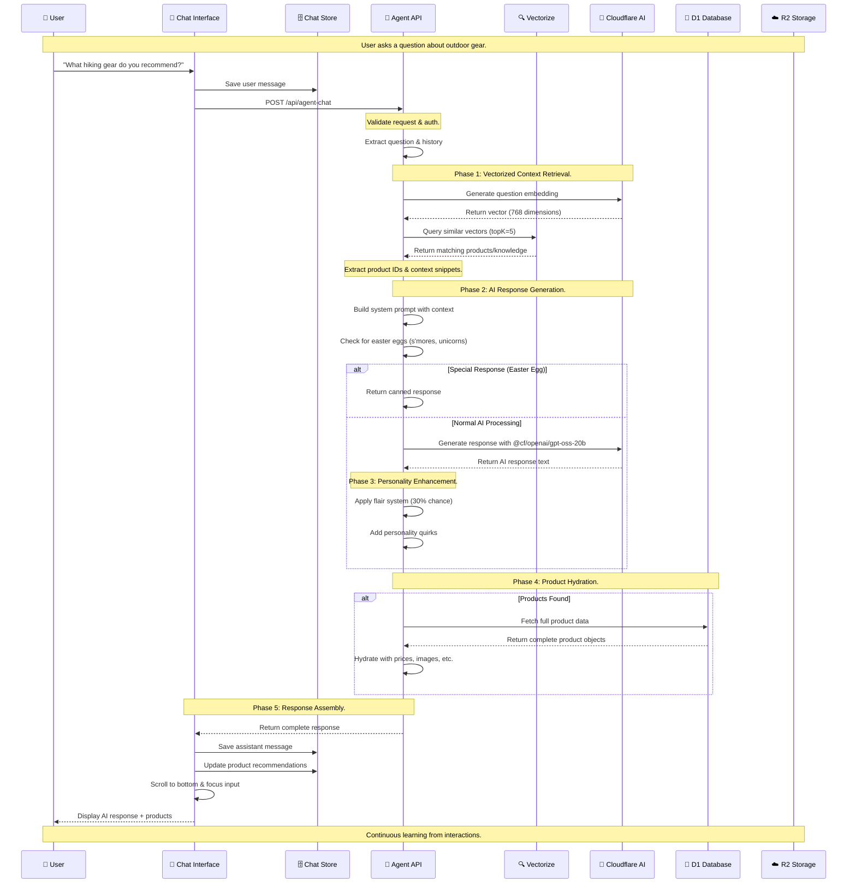
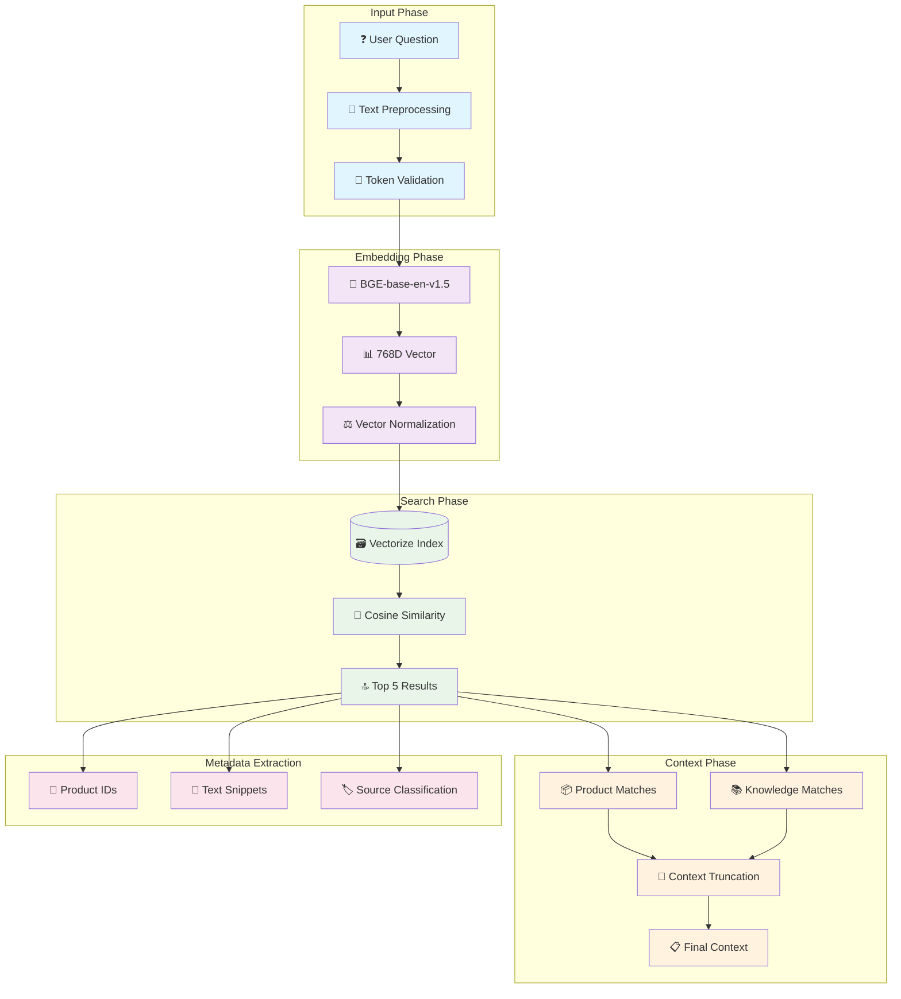
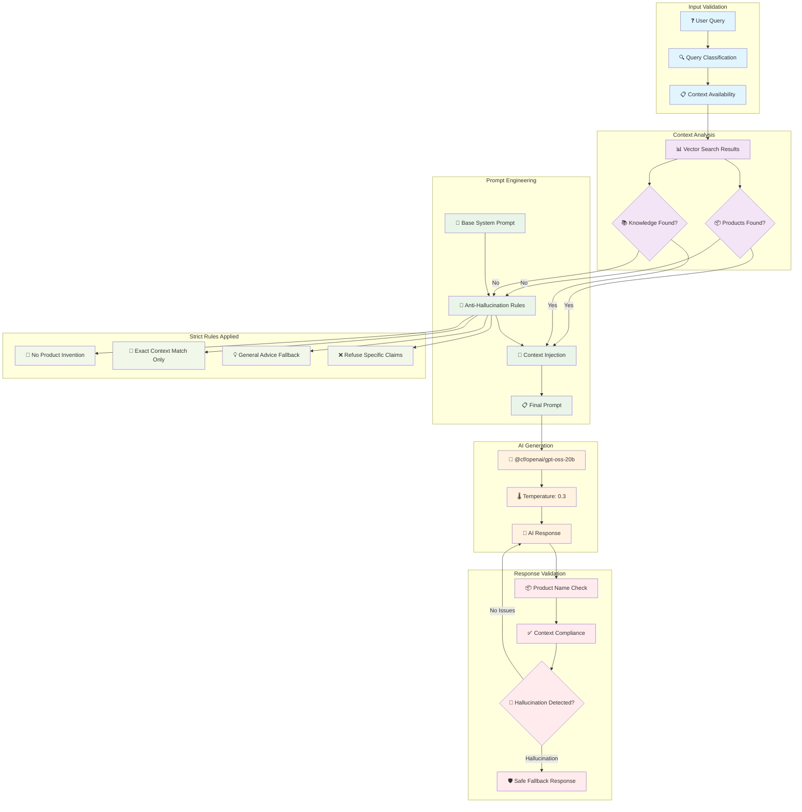
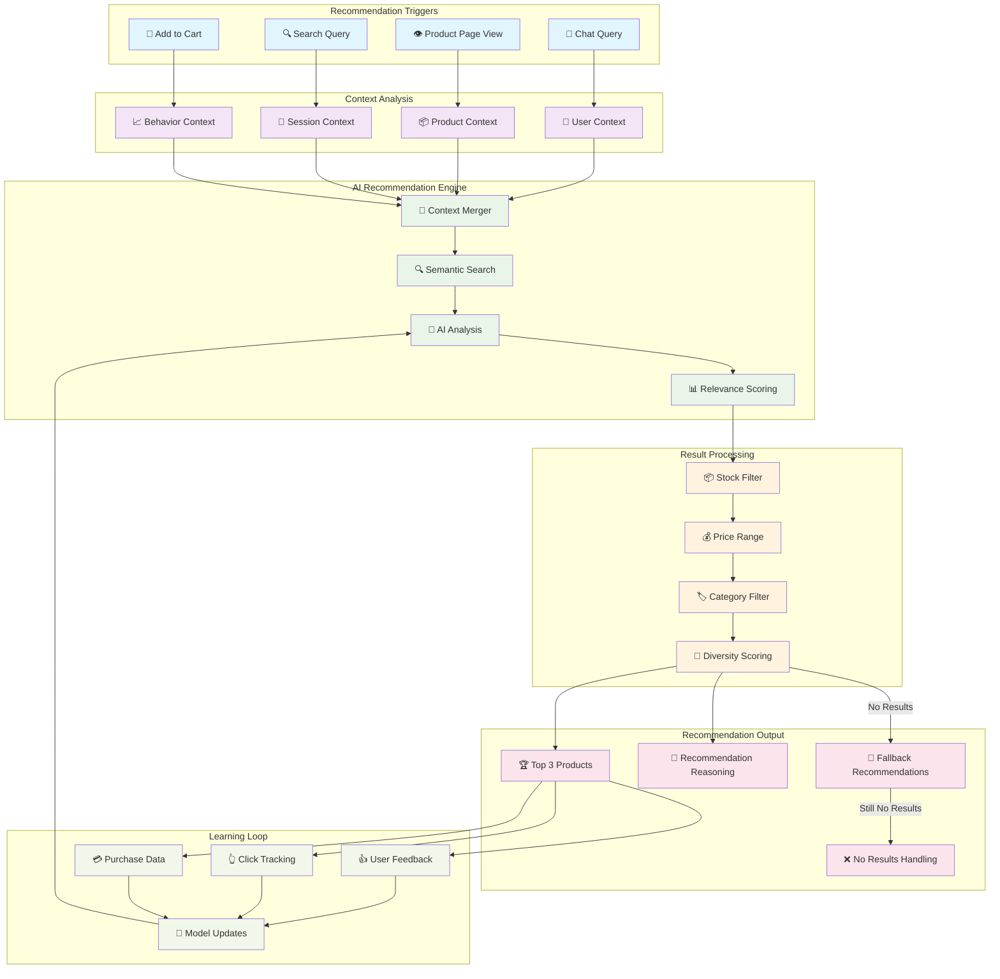

# AI pipeline

**Status:** Current (2026-09-05).

Volt, Mercora's AI shopping assistant, turns a customer question into a grounded response through
embeddings, vector search, and text generation. The prompts, products, and questions in the
diagrams below are sample-catalogue examples — the pipeline itself does not depend on outdoor gear.

## Assistant request flow

The sequence below covers one chat request end to end: session auth, vectorized context retrieval,
response generation with `@cf/openai/gpt-oss-20b`, and product hydration from D1.

```mermaid
sequenceDiagram
    participant User as 👤 User
    participant UI as 💬 Chat Interface
    participant Store as 🗄️ Chat Store
    participant API as 🤖 Agent API
    participant Vec as 🔍 Vectorize
    participant AI as 🧠 Cloudflare AI
    participant DB as 💾 D1 Database
    participant R2 as ☁️ R2 Storage
    Note over User, R2: User asks a question about outdoor gear.
    User->>UI: "What hiking gear do you recommend?"
    UI->>Store: Save user message
    UI->>API: POST /api/agent-chat
    Note over API: Validate request & auth.
    API->>API: Extract question & history
    Note over API, AI: Phase 1: Vectorized Context Retrieval.
    API->>AI: Generate question embedding
    AI-->>API: Return vector (768 dimensions)
    API->>Vec: Query similar vectors (topK=5)
    Vec-->>API: Return matching products/knowledge
    Note over API: Extract product IDs & context snippets.
    Note over API, AI: Phase 2: AI Response Generation.
    API->>API: Build system prompt with context
    API->>API: Check for easter eggs (s'mores, unicorns)
    alt Special Response (Easter Egg)
        API->>API: Return canned response
    else Normal AI Processing
        API->>AI: Generate response with @cf/openai/gpt-oss-20b
        AI-->>API: Return AI response text
        Note over API: Phase 3: Personality Enhancement.
        API->>API: Apply flair system (30% chance)
        API->>API: Add personality quirks
    end
    Note over API, DB: Phase 4: Product Hydration.
    alt Products Found
        API->>DB: Fetch full product data
        DB-->>API: Return complete product objects
        API->>API: Hydrate with prices, images, etc.
    end
    Note over API, UI: Phase 5: Response Assembly.
    API-->>UI: Return complete response
    UI->>Store: Save assistant message
    UI->>Store: Update product recommendations
    UI->>UI: Scroll to bottom & focus input
    UI-->>User: Display AI response + products
    Note over User, R2: Continuous learning from interactions.
```

## Vector search

The diagram below shows how a question becomes a `@cf/baai/bge-base-en-v1.5` embedding. It also
shows how Vectorize ranks the top five matches, and how the pipeline extracts product IDs and
text snippets from the result.

```mermaid
flowchart TD
    %% Input Processing.
    subgraph "Input Phase"
        Question[❓ User Question]
        Preprocess[🔧 Text Preprocessing]
        TokenLimit[📏 Token Validation]
    end
    %% Embedding Generation.
    subgraph "Embedding Phase"
        BGEModel[🧮 BGE-base-en-v1.5]
        Vector[📊 768D Vector]
        Normalize[⚖️ Vector Normalization]
    end
    %% Vector Database Query.
    subgraph "Search Phase"
        VectorDB[(🗃️ Vectorize Index)]
        Similarity[📐 Cosine Similarity]
        TopK[🔝 Top 5 Results]
    end
    %% Context Assembly.
    subgraph "Context Phase"
        ProductContext[📦 Product Matches]
        KnowledgeContext[📚 Knowledge Matches]
        ContextLimit[📏 Context Truncation]
        FinalContext[📋 Final Context]
    end
    %% Flow.
    Question --> Preprocess
    Preprocess --> TokenLimit
    TokenLimit --> BGEModel
    BGEModel --> Vector
    Vector --> Normalize
    Normalize --> VectorDB
    VectorDB --> Similarity
    Similarity --> TopK
    TopK --> ProductContext
    TopK --> KnowledgeContext
    ProductContext --> ContextLimit
    KnowledgeContext --> ContextLimit
    ContextLimit --> FinalContext
    %% Metadata Extraction.
    subgraph "Metadata Extraction"
        ProductIDs[🔢 Product IDs]
        TextSnippets[📝 Text Snippets]
        SourceTypes[🏷️ Source Classification]
    end
    TopK --> ProductIDs
    TopK --> TextSnippets
    TopK --> SourceTypes
    %% Styling.
    classDef input fill:#e1f5fe
    classDef embed fill:#f3e5f5
    classDef search fill:#e8f5e8
    classDef context fill:#fff3e0
    classDef meta fill:#fce4ec
    class Question,Preprocess,TokenLimit input
    class BGEModel,Vector,Normalize embed
    class VectorDB,Similarity,TopK search
    class ProductContext,KnowledgeContext,ContextLimit,FinalContext context
    class ProductIDs,TextSnippets,SourceTypes meta
```

## Anti-hallucination checks

The diagram below shows how the pipeline chooses between injecting retrieved context and falling
back to strict rules. It also shows how the pipeline screens the model's response for unsupported
product mentions before returning it.

```mermaid
flowchart TD
    %% Input Validation.
    subgraph "Input Validation"
        UserQuery[❓ User Query]
        QueryType[🔍 Query Classification]
        ContextCheck[📋 Context Availability]
    end
    %% Context Analysis.
    subgraph "Context Analysis"
        VectorResults[📊 Vector Search Results]
        ProductAvailable{📦 Products Found?}
        KnowledgeAvailable{📚 Knowledge Found?}
    end
    %% Prompt Engineering.
    subgraph "Prompt Engineering"
        BasePrompt[📝 Base System Prompt]
        StrictRules[🚫 Anti-Hallucination Rules]
        ContextInjection[💉 Context Injection]
        FinalPrompt[📋 Final Prompt]
    end
    %% AI Generation.
    subgraph "AI Generation"
        TextModel["🧠 @cf/openai/gpt-oss-20b"]
        LowTemp[🌡️ Temperature: 0.3]
        Response[💭 AI Response]
    end
    %% Response Validation.
    subgraph "Response Validation"
        ProductMentions[📦 Product Name Check]
        ContextCompliance[✅ Context Compliance]
        FallbackTrigger{🚨 Hallucination Detected?}
        SafeResponse[🛡️ Safe Fallback Response]
    end
    %% Flow.
    UserQuery --> QueryType
    QueryType --> ContextCheck
    ContextCheck --> VectorResults
    VectorResults --> ProductAvailable
    VectorResults --> KnowledgeAvailable
    ProductAvailable -->|Yes| ContextInjection
    ProductAvailable -->|No| StrictRules
    KnowledgeAvailable -->|Yes| ContextInjection
    KnowledgeAvailable -->|No| StrictRules
    BasePrompt --> StrictRules
    StrictRules --> ContextInjection
    ContextInjection --> FinalPrompt
    FinalPrompt --> TextModel
    TextModel --> LowTemp
    LowTemp --> Response
    Response --> ProductMentions
    ProductMentions --> ContextCompliance
    ContextCompliance --> FallbackTrigger
    FallbackTrigger -->|No Issues| Response
    FallbackTrigger -->|Hallucination| SafeResponse
    %% Anti-Hallucination Rules.
    subgraph "Strict Rules Applied"
        NoInvention[🚫 No Product Invention]
        ExactMatch[🎯 Exact Context Match Only]
        GeneralAdvice[💡 General Advice Fallback]
        RefuseSpecific[❌ Refuse Specific Claims]
    end
    StrictRules --> NoInvention
    StrictRules --> ExactMatch
    StrictRules --> GeneralAdvice
    StrictRules --> RefuseSpecific
    %% Styling.
    classDef input fill:#e1f5fe
    classDef analysis fill:#f3e5f5
    classDef prompt fill:#e8f5e8
    classDef ai fill:#fff3e0
    classDef validation fill:#ffebee
    classDef rules fill:#f1f8e9
    class UserQuery,QueryType,ContextCheck input
    class VectorResults,ProductAvailable,KnowledgeAvailable analysis
    class BasePrompt,StrictRules,ContextInjection,FinalPrompt prompt
    class TextModel,LowTemp,Response ai
    class ProductMentions,ContextCompliance,FallbackTrigger,SafeResponse validation
    class NoInvention,ExactMatch,GeneralAdvice,RefuseSpecific rules
```

## Product recommendations

The diagram below shows how a chat query, a product view, a cart add, or a search query feeds the
same recommendation pipeline. That pipeline merges context, searches vectors, filters results, and
folds a feedback loop of clicks and purchases back into ranking.

```mermaid
graph TB
    %% Trigger Events.
    subgraph "Recommendation Triggers"
        ChatQuery[💬 Chat Query]
        ProductView[👁️ Product Page View]
        CartAdd[🛒 Add to Cart]
        SearchQuery[🔍 Search Query]
    end
    %% Context Building.
    subgraph "Context Analysis"
        UserContext[👤 User Context]
        ProductContext[📦 Product Context]
        SessionContext[📱 Session Context]
        BehaviorContext[📈 Behavior Context]
    end
    %% AI Processing.
    subgraph "AI Recommendation Engine"
        ContextMerge[🔄 Context Merger]
        VectorSearch[🔍 Semantic Search]
        AIAnalysis[🧠 AI Analysis]
        Relevance[📊 Relevance Scoring]
    end
    %% Filtering & Ranking.
    subgraph "Result Processing"
        InventoryFilter[📦 Stock Filter]
        PriceFilter[💰 Price Range]
        CategoryFilter[🏷️ Category Filter]
        DiversityCheck[🎯 Diversity Scoring]
    end
    %% Output Generation.
    subgraph "Recommendation Output"
        TopProducts[🏆 Top 3 Products]
        Reasoning[💭 Recommendation Reasoning]
        FallbackRecs[🔄 Fallback Recommendations]
        NoResults[❌ No Results Handling]
    end
    %% Flow.
    ChatQuery --> UserContext
    ProductView --> ProductContext
    CartAdd --> BehaviorContext
    SearchQuery --> SessionContext
    UserContext --> ContextMerge
    ProductContext --> ContextMerge
    SessionContext --> ContextMerge
    BehaviorContext --> ContextMerge
    ContextMerge --> VectorSearch
    VectorSearch --> AIAnalysis
    AIAnalysis --> Relevance
    Relevance --> InventoryFilter
    InventoryFilter --> PriceFilter
    PriceFilter --> CategoryFilter
    CategoryFilter --> DiversityCheck
    DiversityCheck --> TopProducts
    DiversityCheck --> Reasoning
    DiversityCheck -->|No Results| FallbackRecs
    FallbackRecs -->|Still No Results| NoResults
    %% Feedback Loop.
    subgraph "Learning Loop"
        UserFeedback[👍 User Feedback]
        ClickThrough[👆 Click Tracking]
        PurchaseData[💳 Purchase Data]
        ModelUpdate[🔄 Model Updates]
    end
    TopProducts --> UserFeedback
    TopProducts --> ClickThrough
    TopProducts --> PurchaseData
    UserFeedback --> ModelUpdate
    ClickThrough --> ModelUpdate
    PurchaseData --> ModelUpdate
    ModelUpdate --> AIAnalysis
    %% Styling.
    classDef trigger fill:#e1f5fe
    classDef context fill:#f3e5f5
    classDef ai fill:#e8f5e8
    classDef filter fill:#fff3e0
    classDef output fill:#fce4ec
    classDef learning fill:#f1f8e9
    class ChatQuery,ProductView,CartAdd,SearchQuery trigger
    class UserContext,ProductContext,SessionContext,BehaviorContext context
    class ContextMerge,VectorSearch,AIAnalysis,Relevance ai
    class InventoryFilter,PriceFilter,CategoryFilter,DiversityCheck filter
    class TopProducts,Reasoning,FallbackRecs,NoResults output
    class UserFeedback,ClickThrough,PurchaseData,ModelUpdate learning
```
