# AI Processing Pipeline Documentation

## Volt AI Assistant - Detailed Processing Flow

```mermaid
sequenceDiagram
    participant User as 👤 User
    participant UI as 💬 Chat Interface
    participant Store as 🗄️ Chat Store
    participant API as 🤖 Agent API
    participant Vec as 🔍 Vectorize
    participant AI as 🧠 Cloudflare AI
    participant DB as 💾 D1 Database
    participant R2 as ☁️ R2 Storage

    Note over User, R2: User asks a question about outdoor gear

    User->>UI: "What hiking gear do you recommend?"
    UI->>Store: Save user message
    UI->>API: POST /api/agent-chat

    Note over API: Validate request & auth
    API->>API: Extract question & history

    Note over API, AI: Phase 1: Vectorized Context Retrieval
    API->>AI: Generate question embedding
    AI-->>API: Return vector (768 dimensions)
    
    API->>Vec: Query similar vectors (topK=5)
    Vec-->>API: Return matching products/knowledge
    
    Note over API: Extract product IDs & context snippets

    Note over API, AI: Phase 2: AI Response Generation
    API->>API: Build system prompt with context
    API->>API: Check for easter eggs (s'mores, unicorns)
    
    alt Special Response (Easter Egg)
        API->>API: Return canned response
    else Normal AI Processing
        API->>AI: Generate response with Llama 3.1 8B
        AI-->>API: Return AI response text
        
        Note over API: Phase 3: Personality Enhancement
        API->>API: Apply flair system (30% chance)
        API->>API: Add personality quirks
    end

    Note over API, DB: Phase 4: Product Hydration
    alt Products Found
        API->>DB: Fetch full product data
        DB-->>API: Return complete product objects
        API->>API: Hydrate with prices, images, etc.
    end

    Note over API, UI: Phase 5: Response Assembly
    API-->>UI: Return complete response
    UI->>Store: Save assistant message
    UI->>Store: Update product recommendations
    UI->>UI: Scroll to bottom & focus input
    UI-->>User: Display AI response + products

    Note over User, R2: Continuous learning from interactions
```

## Vector Search Deep Dive

```mermaid
flowchart TD
    %% Input Processing
    subgraph "Input Phase"
        Question[❓ User Question]
        Preprocess[🔧 Text Preprocessing]
        TokenLimit[📏 Token Validation]
    end

    %% Embedding Generation
    subgraph "Embedding Phase"
        BGEModel[🧮 BGE-base-en-v1.5]
        Vector[📊 768D Vector]
        Normalize[⚖️ Vector Normalization]
    end

    %% Vector Database Query
    subgraph "Search Phase"
        VectorDB[(🗃️ Vectorize Index)]
        Similarity[📐 Cosine Similarity]
        TopK[🔝 Top 5 Results]
    end

    %% Context Assembly
    subgraph "Context Phase"
        ProductContext[📦 Product Matches]
        KnowledgeContext[📚 Knowledge Matches]
        ContextLimit[📏 Context Truncation]
        FinalContext[📋 Final Context]
    end

    %% Flow
    Question --> Preprocess
    Preprocess --> TokenLimit
    TokenLimit --> BGEModel
    
    BGEModel --> Vector
    Vector --> Normalize
    Normalize --> VectorDB
    
    VectorDB --> Similarity
    Similarity --> TopK
    TopK --> ProductContext
    TopK --> KnowledgeContext
    
    ProductContext --> ContextLimit
    KnowledgeContext --> ContextLimit
    ContextLimit --> FinalContext

    %% Metadata Extraction
    subgraph "Metadata Extraction"
        ProductIDs[🔢 Product IDs]
        TextSnippets[📝 Text Snippets]
        SourceTypes[🏷️ Source Classification]
    end

    TopK --> ProductIDs
    TopK --> TextSnippets
    TopK --> SourceTypes

    %% Styling
    classDef input fill:#e1f5fe
    classDef embed fill:#f3e5f5
    classDef search fill:#e8f5e8
    classDef context fill:#fff3e0
    classDef meta fill:#fce4ec

    class Question,Preprocess,TokenLimit input
    class BGEModel,Vector,Normalize embed
    class VectorDB,Similarity,TopK search
    class ProductContext,KnowledgeContext,ContextLimit,FinalContext context
    class ProductIDs,TextSnippets,SourceTypes meta
```

## Anti-Hallucination System

```mermaid
flowchart TD
    %% Input Validation
    subgraph "Input Validation"
        UserQuery[❓ User Query]
        QueryType[🔍 Query Classification]
        ContextCheck[📋 Context Availability]
    end

    %% Context Analysis
    subgraph "Context Analysis"
        VectorResults[📊 Vector Search Results]
        ProductAvailable{📦 Products Found?}
        KnowledgeAvailable{📚 Knowledge Found?}
    end

    %% Prompt Engineering
    subgraph "Prompt Engineering"
        BasePrompt[📝 Base System Prompt]
        StrictRules[🚫 Anti-Hallucination Rules]
        ContextInjection[💉 Context Injection]
        FinalPrompt[📋 Final Prompt]
    end

    %% AI Generation
    subgraph "AI Generation"
        LlamaModel[🧠 Llama 3.1 8B]
        LowTemp[🌡️ Temperature: 0.3]
        Response[💭 AI Response]
    end

    %% Response Validation
    subgraph "Response Validation"
        ProductMentions[📦 Product Name Check]
        ContextCompliance[✅ Context Compliance]
        FallbackTrigger{🚨 Hallucination Detected?}
        SafeResponse[🛡️ Safe Fallback Response]
    end

    %% Flow
    UserQuery --> QueryType
    QueryType --> ContextCheck
    ContextCheck --> VectorResults

    VectorResults --> ProductAvailable
    VectorResults --> KnowledgeAvailable

    ProductAvailable -->|Yes| ContextInjection
    ProductAvailable -->|No| StrictRules
    KnowledgeAvailable -->|Yes| ContextInjection
    KnowledgeAvailable -->|No| StrictRules

    BasePrompt --> StrictRules
    StrictRules --> ContextInjection
    ContextInjection --> FinalPrompt

    FinalPrompt --> LlamaModel
    LlamaModel --> LowTemp
    LowTemp --> Response

    Response --> ProductMentions
    ProductMentions --> ContextCompliance
    ContextCompliance --> FallbackTrigger

    FallbackTrigger -->|No Issues| Response
    FallbackTrigger -->|Hallucination| SafeResponse

    %% Anti-Hallucination Rules
    subgraph "Strict Rules Applied"
        NoInvention[🚫 No Product Invention]
        ExactMatch[🎯 Exact Context Match Only]
        GeneralAdvice[💡 General Advice Fallback]
        RefuseSpecific[❌ Refuse Specific Claims]
    end

    StrictRules --> NoInvention
    StrictRules --> ExactMatch
    StrictRules --> GeneralAdvice
    StrictRules --> RefuseSpecific

    %% Styling
    classDef input fill:#e1f5fe
    classDef analysis fill:#f3e5f5
    classDef prompt fill:#e8f5e8
    classDef ai fill:#fff3e0
    classDef validation fill:#ffebee
    classDef rules fill:#f1f8e9

    class UserQuery,QueryType,ContextCheck input
    class VectorResults,ProductAvailable,KnowledgeAvailable analysis
    class BasePrompt,StrictRules,ContextInjection,FinalPrompt prompt
    class LlamaModel,LowTemp,Response ai
    class ProductMentions,ContextCompliance,FallbackTrigger,SafeResponse validation
    class NoInvention,ExactMatch,GeneralAdvice,RefuseSpecific rules
```

## Product Recommendation Engine

```mermaid
graph TB
    %% Trigger Events
    subgraph "Recommendation Triggers"
        ChatQuery[💬 Chat Query]
        ProductView[👁️ Product Page View]
        CartAdd[🛒 Add to Cart]
        SearchQuery[🔍 Search Query]
    end

    %% Context Building
    subgraph "Context Analysis"
        UserContext[👤 User Context]
        ProductContext[📦 Product Context]
        SessionContext[📱 Session Context]
        BehaviorContext[📈 Behavior Context]
    end

    %% AI Processing
    subgraph "AI Recommendation Engine"
        ContextMerge[🔄 Context Merger]
        VectorSearch[🔍 Semantic Search]
        AIAnalysis[🧠 AI Analysis]
        Relevance[📊 Relevance Scoring]
    end

    %% Filtering & Ranking
    subgraph "Result Processing"
        InventoryFilter[📦 Stock Filter]
        PriceFilter[💰 Price Range]
        CategoryFilter[🏷️ Category Filter]
        DiversityCheck[🎯 Diversity Scoring]
    end

    %% Output Generation
    subgraph "Recommendation Output"
        TopProducts[🏆 Top 3 Products]
        Reasoning[💭 Recommendation Reasoning]
        FallbackRecs[🔄 Fallback Recommendations]
        NoResults[❌ No Results Handling]
    end

    %% Flow
    ChatQuery --> UserContext
    ProductView --> ProductContext
    CartAdd --> BehaviorContext
    SearchQuery --> SessionContext

    UserContext --> ContextMerge
    ProductContext --> ContextMerge
    SessionContext --> ContextMerge
    BehaviorContext --> ContextMerge

    ContextMerge --> VectorSearch
    VectorSearch --> AIAnalysis
    AIAnalysis --> Relevance

    Relevance --> InventoryFilter
    InventoryFilter --> PriceFilter
    PriceFilter --> CategoryFilter
    CategoryFilter --> DiversityCheck

    DiversityCheck --> TopProducts
    DiversityCheck --> Reasoning
    DiversityCheck -->|No Results| FallbackRecs
    FallbackRecs -->|Still No Results| NoResults

    %% Feedback Loop
    subgraph "Learning Loop"
        UserFeedback[👍 User Feedback]
        ClickThrough[👆 Click Tracking]
        PurchaseData[💳 Purchase Data]
        ModelUpdate[🔄 Model Updates]
    end

    TopProducts --> UserFeedback
    TopProducts --> ClickThrough
    TopProducts --> PurchaseData
    
    UserFeedback --> ModelUpdate
    ClickThrough --> ModelUpdate
    PurchaseData --> ModelUpdate
    ModelUpdate --> AIAnalysis

    %% Styling
    classDef trigger fill:#e1f5fe
    classDef context fill:#f3e5f5
    classDef ai fill:#e8f5e8
    classDef filter fill:#fff3e0
    classDef output fill:#fce4ec
    classDef learning fill:#f1f8e9

    class ChatQuery,ProductView,CartAdd,SearchQuery trigger
    class UserContext,ProductContext,SessionContext,BehaviorContext context
    class ContextMerge,VectorSearch,AIAnalysis,Relevance ai
    class InventoryFilter,PriceFilter,CategoryFilter,DiversityCheck filter
    class TopProducts,Reasoning,FallbackRecs,NoResults output
    class UserFeedback,ClickThrough,PurchaseData,ModelUpdate learning
```

---

*AI Pipeline Documentation for Mercora Platform*
*Detailed technical flows for development and debugging*
