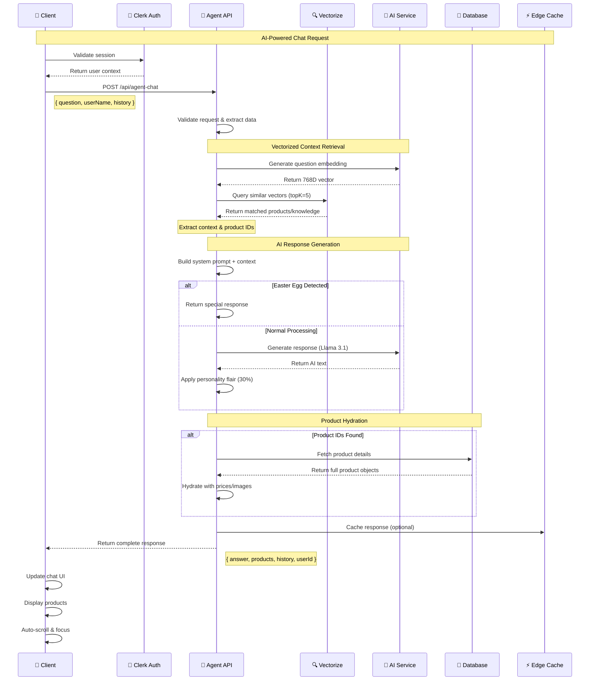
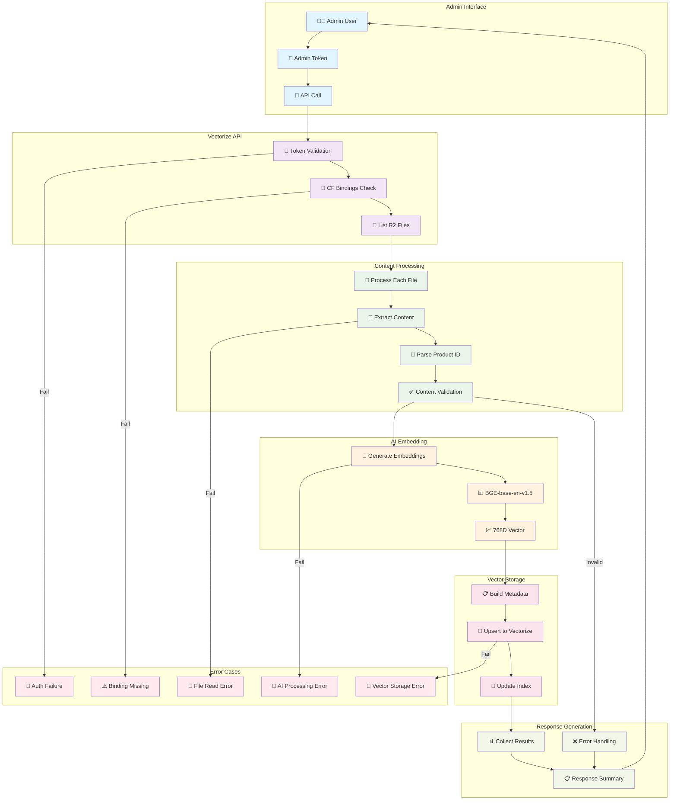
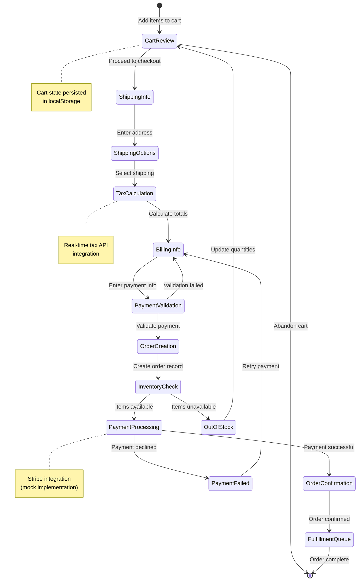
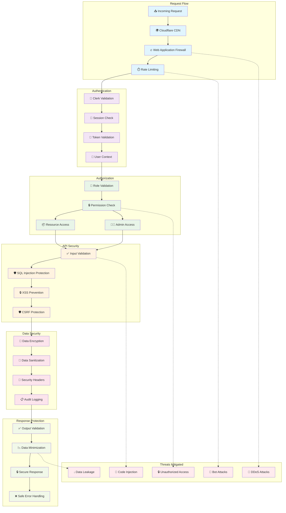

# API Architecture Documentation

## Current API Structure Overview

The API has been refactored to eliminate redundancy and follow RESTful principles with clean, top-level endpoints.

```mermaid
graph TB
    %% Client Layer
    subgraph "Client Applications"
        WebApp[🌐 Web Application]
        Mobile[📱 Mobile App]
        Admin[👨‍💼 Admin Dashboard]
    end

    %% API Gateway
    subgraph "Unified API Layer"
        AgentChat[🤖 /api/agent-chat]
        Orders[📦 /api/orders]
        PaymentIntent[💳 /api/payment-intent]
        Tax[💰 /api/tax]
        Products[📋 /api/products]
        Categories[📂 /api/categories]
        ShippingOptions[🚚 /api/shipping-options]
        Vectorize[🔍 /api/vectorize]
        StripeWebhooks[🔔 /api/webhooks/stripe]
    end

    %% Core Services
    subgraph "Core Services"
        AIService[🧠 AI Processing]
        VectorService[🔍 Vector Search]
        OrderService[📦 Order Management]
        PaymentService[💳 Stripe Integration]
        ShippingService[🚚 Shipping Logic]
        TaxService[💰 Stripe Tax]
    end

    %% Data Layer
    subgraph "Data Infrastructure"
        D1Database[(💾 D1 Database)]
        VectorDatabase[(🗃️ Vectorize Index)]
        R2Storage[☁️ R2 Storage]
        ExternalAPIs[🔌 External APIs]
    end

    %% Connections
    WebApp --> AgentChat
    WebApp --> Orders
    WebApp --> PaymentIntent
    WebApp --> Tax
    WebApp --> Products
    WebApp --> ShippingOptions
    
    Mobile --> AgentChat
    Mobile --> Orders
    Mobile --> Products
    
    Admin --> VectorizeProducts
    Admin --> VectorizeKnowledge
    Admin --> Orders
    Admin --> Products
    Admin --> Categories

    AgentChat --> AIService
    AgentChat --> VectorService
    VectorizeProducts --> VectorService
    VectorizeKnowledge --> VectorService
    
    Orders --> OrderService
    PaymentIntent --> PaymentService
    Tax --> TaxService
    ShippingOptions --> ShippingService
    StripeWebhooks --> OrderService

    AIService --> VectorDatabase
    VectorService --> VectorDatabase
    VectorService --> R2Storage
    OrderService --> D1Database
    PaymentService --> StripeAPI[🔌 Stripe API]
    TaxService --> StripeAPI
    ShippingService --> ExternalAPIs

    %% Styling
    classDef client fill:#e1f5fe
    classDef api fill:#f3e5f5
    classDef service fill:#e8f5e8
    classDef data fill:#fff3e0

    class WebApp,Mobile,Admin client
    class AgentChat,Orders,PaymentIntent,Tax,Products,Categories,ShippingOptions,VectorizeProducts,VectorizeKnowledge,StripeWebhooks api
    class AIService,VectorService,OrderService,PaymentService,TaxService,ShippingService service
    class D1Database,VectorDatabase,R2Storage,StripeAPI,ExternalAPIs data
```



## 📋 Unified API Endpoints

### **Core Resources**
```
├── /api/orders              # UNIFIED order management
│   ├── GET    - List orders (with filtering)
│   ├── POST   - Create new orders  
│   └── PUT    - Update order status
├── /api/orders/[id]         # Specific order operations
│   ├── GET    - Get order details
│   └── PUT    - Update specific order
```

### **Payment & Tax (Stripe Integration)**
```
├── /api/payment-intent      # Stripe payment creation
│   └── POST   - Create payment intent (requires pre-calculated tax)
├── /api/tax                 # Tax calculation (Stripe Tax)
│   └── POST   - Calculate tax based on address + items
├── /api/webhooks/stripe     # Payment status updates
│   └── POST   - Handle Stripe webhook events
├── /api/validate-discount   # Discount validation
│   └── POST   - Validate discount codes
```

### **Products & Categories** 
```
├── /api/products            # Product catalog
│   ├── GET    - List products (with filters)
│   └── POST   - Add products (admin)
├── /api/products/[id]       # Specific product
│   ├── GET    - Get product details
│   └── PUT    - Update product (admin)
├── /api/categories          # Product categories
│   ├── GET    - List categories
│   └── POST   - Add categories (admin)
├── /api/categories/[id]     # Specific category
│   ├── GET    - Get category details
│   └── PUT    - Update category (admin)
```

### **Commerce Support**
```
├── /api/shipping-options    # Shipping calculation
│   └── POST   - Get shipping options for address
```

### **AI & Content**
```
├── /api/agent-chat          # AI assistant
│   └── POST   - Chat with Volt AI assistant
├── /api/vectorize           # Consolidated content indexing
│   └── GET    - Index products + knowledge articles (atomic operation)
```

## 🎯 Checkout Flow

The unified checkout process follows this clear separation of concerns:

```javascript
// 1. Calculate tax
const taxResponse = await fetch('/api/tax', {
  method: 'POST',
  body: JSON.stringify({ items, shippingAddress, shippingCost })
});

// 2. Create payment intent
const paymentResponse = await fetch('/api/payment-intent', {
  method: 'POST', 
  body: JSON.stringify({ 
    amount: total, 
    taxAmount: tax, 
    shippingAddress, 
    orderId 
  })
});

// 3. Process payment (Stripe handles)
// 4. Create order after payment success
const orderResponse = await fetch('/api/orders', {
  method: 'POST',
  body: JSON.stringify({ items, shipping_address, tax_amount, payment_intent_id })
});
```

## 🔒 Authentication Patterns

### **User Endpoints** (Clerk Auth)
- `/api/orders` (user's own orders)
- `/api/payment-intent` 
- `/api/tax`

### **Admin Endpoints** (API Key Auth)
- `/api/orders?admin=true`
- `/api/orders` (PUT with admin permissions)
- `/api/products` (POST/PUT)

### **Webhook Endpoints** (Signature Auth)
- `/api/webhooks/stripe` (Stripe signature verification)

## Agent Chat API Flow



## Vectorization Pipeline



## Order Processing Flow



## API Security Model



---

*API Architecture Documentation for Mercora Platform*
*Comprehensive technical specifications for all API endpoints*
