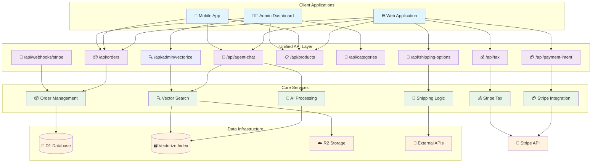
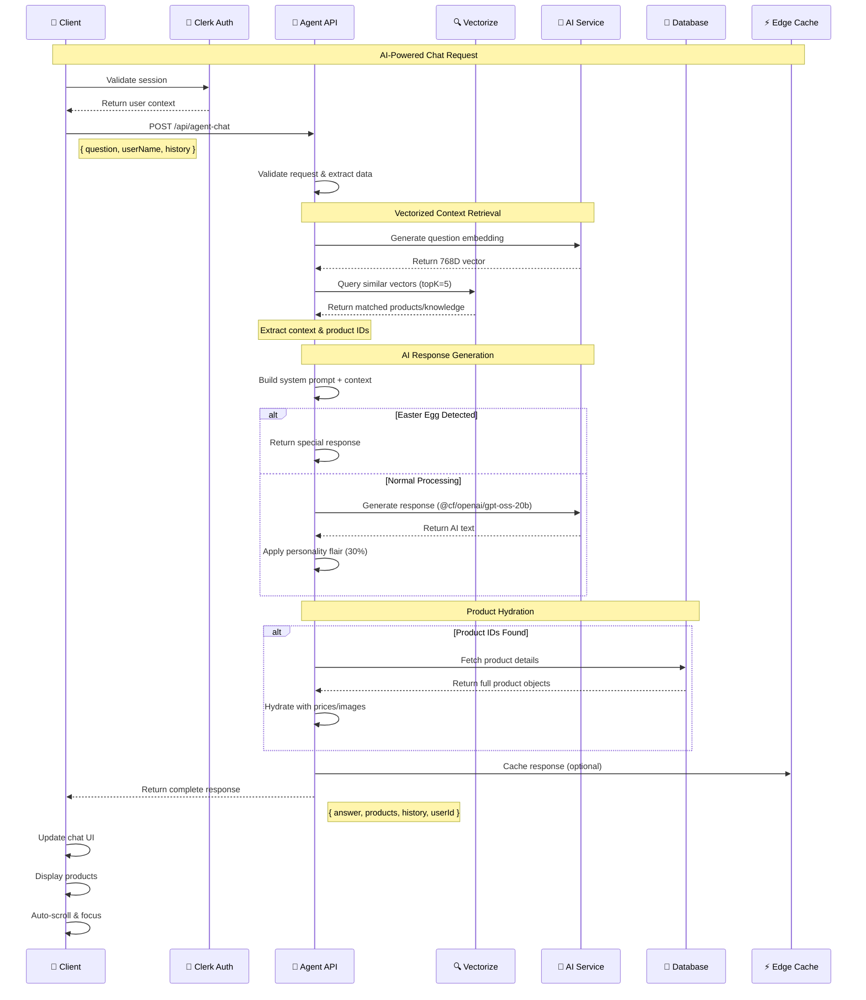
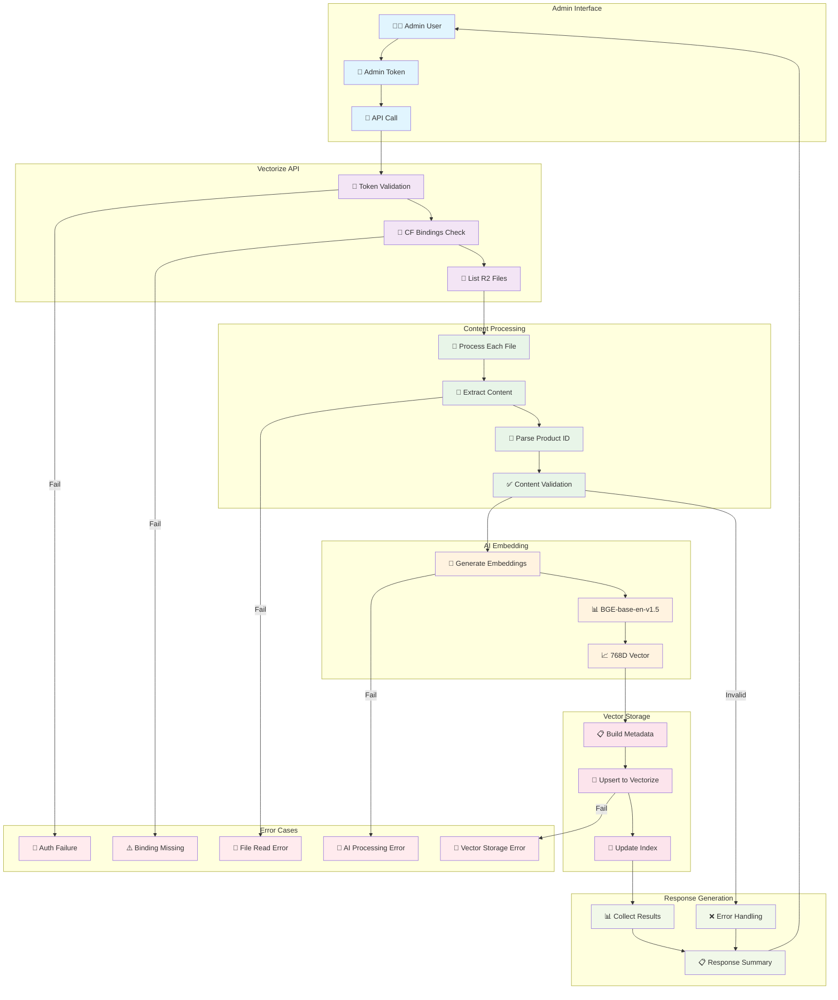
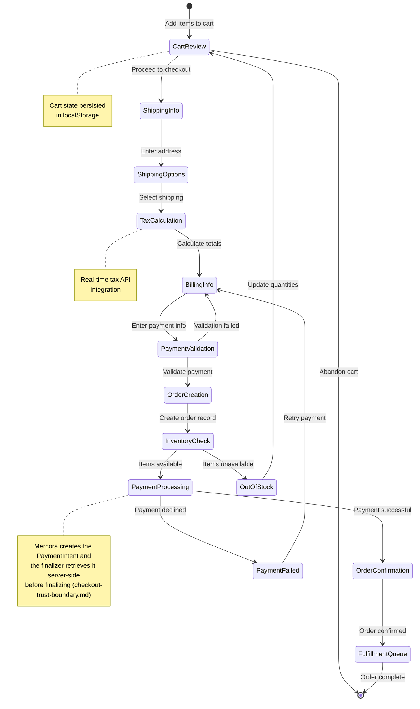
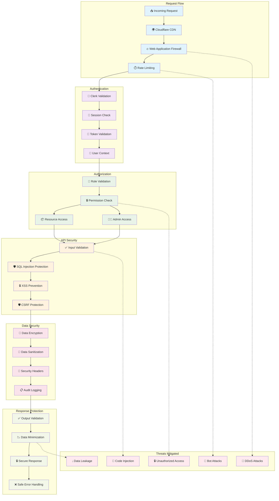

# API Architecture Documentation

## Current API Structure Overview

The API has been refactored to eliminate redundancy and follow RESTful principles with clean, top-level endpoints.


```mermaid
graph TB
    %% Client Layer
    subgraph "Client Applications"
        WebApp[🌐 Web Application]
        Mobile[📱 Mobile App]
        Admin[👨‍💼 Admin Dashboard]
    end

    %% API Gateway
    subgraph "Unified API Layer"
        AgentChat[🤖 /api/agent-chat]
        Orders[📦 /api/orders]
        PaymentIntent[💳 /api/payment-intent]
        Tax[💰 /api/tax]
        Products[📋 /api/products]
        Categories[📂 /api/categories]
        ShippingOptions[🚚 /api/shipping-options]
        Vectorize[🔍 /api/admin/vectorize]
        StripeWebhooks[🔔 /api/webhooks/stripe]
    end

    %% Core Services
    subgraph "Core Services"
        AIService[🧠 AI Processing]
        VectorService[🔍 Vector Search]
        OrderService[📦 Order Management]
        PaymentService[💳 Stripe Integration]
        ShippingService[🚚 Shipping Logic]
        TaxService[💰 Stripe Tax]
    end

    %% Data Layer
    subgraph "Data Infrastructure"
        D1Database[(💾 D1 Database)]
        VectorDatabase[(🗃️ Vectorize Index)]
        R2Storage[☁️ R2 Storage]
        ExternalAPIs[🔌 External APIs]
    end

    %% Connections
    WebApp --> AgentChat
    WebApp --> Orders
    WebApp --> PaymentIntent
    WebApp --> Tax
    WebApp --> Products
    WebApp --> ShippingOptions
    
    Mobile --> AgentChat
    Mobile --> Orders
    Mobile --> Products
    
    Admin --> Vectorize
    Admin --> Orders
    Admin --> Products
    Admin --> Categories

    AgentChat --> AIService
    AgentChat --> VectorService
    Vectorize --> VectorService
    
    Orders --> OrderService
    PaymentIntent --> PaymentService
    Tax --> TaxService
    ShippingOptions --> ShippingService
    StripeWebhooks --> OrderService

    AIService --> VectorDatabase
    VectorService --> VectorDatabase
    VectorService --> R2Storage
    OrderService --> D1Database
    PaymentService --> StripeAPI[🔌 Stripe API]
    TaxService --> StripeAPI
    ShippingService --> ExternalAPIs

    %% Styling
    classDef client fill:#e1f5fe
    classDef api fill:#f3e5f5
    classDef service fill:#e8f5e8
    classDef data fill:#fff3e0

    class WebApp,Mobile,Admin client
    class AgentChat,Orders,PaymentIntent,Tax,Products,Categories,ShippingOptions,StripeWebhooks api
    class AIService,VectorService,OrderService,PaymentService,TaxService,ShippingService service
    class D1Database,VectorDatabase,R2Storage,StripeAPI,ExternalAPIs data
```

## 📋 Unified API Endpoints

### **Core Resources**
```
├── /api/orders              # UNIFIED order management
│   ├── GET    - List orders (with owner/admin authorization)
│   ├── POST   - Verify Stripe and finalize a pending order
│   └── PUT    - Update allowlisted metadata with optimistic concurrency
├── /api/orders/[id]         # Specific order operations
│   └── GET    - Get owner/admin-authorized order details
```

### **Payment & Tax (Stripe Integration)**
```
├── /api/payment-intent      # Stripe payment creation
│   └── POST   - Price lines, persist pending order, create bound intent
├── /api/tax                 # Standalone tax estimate (not checkout authority)
│   └── POST   - Estimate tax based on address + items
├── /api/webhooks/stripe     # Payment status updates
│   └── POST   - Handle Stripe webhook events
├── /api/validate-discount   # Discount validation
│   └── POST   - Validate discount codes
```

### **Products & Categories** 
```
├── /api/products            # Product catalog
│   ├── GET    - List products (with filters)
│   └── POST   - Add products (admin)
├── /api/products/[id]       # Specific product
│   ├── GET    - Get product details
│   └── PUT    - Update product (admin)
├── /api/categories          # Product categories
│   ├── GET    - List categories
│   └── POST   - Add categories (admin)
├── /api/categories/[id]     # Specific category
│   ├── GET    - Get category details
│   └── PUT    - Update category (admin)
```

### **Commerce Support**
```
├── /api/shipping-options    # Shipping calculation
│   └── POST   - Get shipping options for address
```

### **AI & Content**
```
├── /api/agent-chat          # AI assistant
│   └── POST   - Chat with Volt AI assistant
├── /api/admin/vectorize     # Consolidated content indexing
│   └── GET    - Index products + knowledge articles (atomic operation)
├── /api/admin/analytics     # AI business intelligence
│   └── POST   - Generate business insights and recommendations
├── /api/admin/generate-article # AI content generation
│   └── POST   - Generate articles and blog content
├── /api/admin/generate-product-description # AI product descriptions
│   └── POST   - Generate enhanced product descriptions
```

### **Admin Management**
```
├── /api/admin/users         # Admin user management
│   ├── GET    - List admin users
│   ├── POST   - Create admin user
│   └── PUT    - Update admin user
├── /api/admin/pages         # CMS page management
│   ├── GET    - List CMS pages
│   ├── POST   - Create CMS page
│   └── PUT    - Update CMS page
├── /api/admin/knowledge     # Knowledge base management
│   ├── GET    - List knowledge articles
│   ├── POST   - Create knowledge article
│   └── PUT    - Update knowledge article
├── /api/admin/settings      # System settings
│   ├── GET    - Get system settings
│   └── PUT    - Update system settings
├── /api/admin/auth-check    # Authentication verification
│   └── GET    - Verify admin authentication
├── /api/admin/generate-token # Admin token generation
│   └── POST   - Generate admin access tokens
├── /api/admin/upload-image  # Image upload management
│   └── POST   - Upload and manage product images
```

## 🎯 Checkout Flow

The unified checkout process follows this clear separation of concerns:

```javascript
// 1. The server prices catalog lines, shipping, discounts, and tax. It persists
// the pending order before releasing the client secret.
const paymentResponse = await fetch('/api/payment-intent', {
  method: 'POST', 
  body: JSON.stringify({ 
    items: cart.map(({ productId, variantId, quantity }) => ({
      productId, variantId, quantity
    })),
    shippingAddress,
    shippingMethodId,
    discountCodes
  })
});

// 2. Render payment-step totals from paymentResponse.quote and confirm Stripe.
// 3. Finalize the existing order; the server retrieves and verifies Stripe.
const finalizationResponse = await fetch('/api/orders', {
  method: 'POST',
  body: JSON.stringify({
    orderId: paymentResponse.orderId,
    paymentIntentId: paymentResponse.paymentIntentId
  })
});
```

## 🔒 Authentication Patterns

### **User Endpoints** (Clerk Auth)
- `/api/orders` (user's own orders)
- `/api/payment-intent` 
- `/api/tax`

### **Admin Endpoints** (API Key Auth)
- `/api/orders?admin=true`
- `/api/orders` (PUT with admin permissions)
- `/api/products` (POST/PUT)

### **Webhook Endpoints** (Signature Auth)
- `/api/webhooks/stripe` (Stripe signature verification)

## Agent Chat API Flow


```mermaid
sequenceDiagram
    participant Client as 📱 Client
    participant Auth as 🔐 Clerk Auth
    participant API as 🤖 Agent API
    participant Vector as 🔍 Vectorize
    participant AI as 🧠 AI Service
    participant DB as 💾 Database
    participant Cache as ⚡ Edge Cache

    Note over Client, Cache: AI-Powered Chat Request

    Client->>Auth: Validate session
    Auth-->>Client: Return user context

    Client->>API: POST /api/agent-chat
    Note right of Client: { question, userName, history }

    API->>API: Validate request & extract data
    
    Note over API, AI: Vectorized Context Retrieval
    API->>AI: Generate question embedding
    AI-->>API: Return 768D vector
    
    API->>Vector: Query similar vectors (topK=5)
    Vector-->>API: Return matched products/knowledge
    
    Note over API: Extract context & product IDs

    Note over API, AI: AI Response Generation
    API->>API: Build system prompt + context
    
    alt Easter Egg Detected
        API->>API: Return special response
    else Normal Processing
        API->>AI: Generate response (@cf/openai/gpt-oss-20b)
        AI-->>API: Return AI text
        API->>API: Apply personality flair (30%)
    end

    Note over API, DB: Product Hydration
    alt Product IDs Found
        API->>DB: Fetch product details
        DB-->>API: Return full product objects
        API->>API: Hydrate with prices/images
    end

    API->>Cache: Cache response (optional)
    API-->>Client: Return complete response
    Note right of API: { answer, products, history, userId }

    Client->>Client: Update chat UI
    Client->>Client: Display products
    Client->>Client: Auto-scroll & focus
```

## Vectorization Pipeline


```mermaid
flowchart TD
    %% Admin Trigger
    subgraph "Admin Interface"
        Admin[👨‍💼 Admin User]
        Token[🔑 Admin Token]
        Trigger[🚀 API Call]
    end

    %% API Processing
    subgraph "Vectorize API"
        Auth[🔐 Token Validation]
        Bindings[🔗 CF Bindings Check]
        FileList[📂 List R2 Files]
    end

    %% File Processing
    subgraph "Content Processing"
        FileLoop[🔄 Process Each File]
        Extract[📄 Extract Content]
        IDParse[🔢 Parse Product ID]
        Validate[✅ Content Validation]
    end

    %% AI Processing
    subgraph "AI Embedding"
        Embedding[🧮 Generate Embeddings]
        BGEModel[📊 BGE-base-en-v1.5]
        Vector[📈 768D Vector]
    end

    %% Storage
    subgraph "Vector Storage"
        Metadata[📋 Build Metadata]
        Upsert[💾 Upsert to Vectorize]
        IndexUpdate[🔄 Update Index]
    end

    %% Response
    subgraph "Response Generation"
        Results[📊 Collect Results]
        Errors[❌ Error Handling]
        Summary[📋 Response Summary]
    end

    %% Flow
    Admin --> Token
    Token --> Trigger
    Trigger --> Auth

    Auth --> Bindings
    Bindings --> FileList
    FileList --> FileLoop

    FileLoop --> Extract
    Extract --> IDParse
    IDParse --> Validate

    Validate --> Embedding
    Embedding --> BGEModel
    BGEModel --> Vector

    Vector --> Metadata
    Metadata --> Upsert
    Upsert --> IndexUpdate

    IndexUpdate --> Results
    Validate -->|Invalid| Errors
    Results --> Summary
    Errors --> Summary

    Summary --> Admin

    %% Error Handling
    subgraph "Error Cases"
        AuthFail[🚫 Auth Failure]
        BindingFail[⚠️ Binding Missing]
        FileFail[📄 File Read Error]
        AIFail[🧠 AI Processing Error]
        VectorFail[💾 Vector Storage Error]
    end

    Auth -->|Fail| AuthFail
    Bindings -->|Fail| BindingFail
    Extract -->|Fail| FileFail
    Embedding -->|Fail| AIFail
    Upsert -->|Fail| VectorFail

    %% Styling
    classDef admin fill:#e1f5fe
    classDef api fill:#f3e5f5
    classDef process fill:#e8f5e8
    classDef ai fill:#fff3e0
    classDef storage fill:#fce4ec
    classDef response fill:#f1f8e9
    classDef error fill:#ffebee

    class Admin,Token,Trigger admin
    class Auth,Bindings,FileList api
    class FileLoop,Extract,IDParse,Validate process
    class Embedding,BGEModel,Vector ai
    class Metadata,Upsert,IndexUpdate storage
    class Results,Errors,Summary response
    class AuthFail,BindingFail,FileFail,AIFail,VectorFail error
```

## Order Processing Flow


```mermaid
stateDiagram-v2
    [*] --> CartReview : Add items to cart
    
    CartReview --> ShippingInfo : Proceed to checkout
    CartReview --> [*] : Abandon cart
    
    ShippingInfo --> ShippingOptions : Enter address
    ShippingOptions --> TaxCalculation : Select shipping
    TaxCalculation --> BillingInfo : Calculate totals
    
    BillingInfo --> PaymentValidation : Enter payment info
    PaymentValidation --> OrderCreation : Validate payment
    PaymentValidation --> BillingInfo : Validation failed
    
    OrderCreation --> InventoryCheck : Create order record
    InventoryCheck --> PaymentProcessing : Items available
    InventoryCheck --> OutOfStock : Items unavailable
    
    OutOfStock --> CartReview : Update quantities
    
    PaymentProcessing --> OrderConfirmation : Payment successful
    PaymentProcessing --> PaymentFailed : Payment declined
    
    PaymentFailed --> BillingInfo : Retry payment
    
    OrderConfirmation --> FulfillmentQueue : Order confirmed
    FulfillmentQueue --> [*] : Order complete

    note right of CartReview
        Cart state persisted
        in localStorage
    end note

    note right of TaxCalculation
        Real-time tax API
        integration
    end note

    note right of PaymentProcessing
        Mercora creates the PaymentIntent and
        the finalizer retrieves it server-side
        before finalizing (checkout-trust-boundary.md)
    end note
```

## API Security Model


```mermaid
graph TB
    %% Request Entry
    subgraph "Request Flow"
        Request[📥 Incoming Request]
        CDN[🌍 Cloudflare CDN]
        WAF[🔥 Web Application Firewall]
        RateLimit[⏱️ Rate Limiting]
    end

    %% Authentication Layer
    subgraph "Authentication"
        ClerkAuth[🔐 Clerk Validation]
        SessionCheck[📝 Session Check]
        TokenValidation[🎫 Token Validation]
        UserContext[👤 User Context]
    end

    %% Authorization Layer
    subgraph "Authorization"
        RoleCheck[👥 Role Validation]
        PermissionCheck[🔒 Permission Check]
        ResourceAccess[📦 Resource Access]
        AdminAccess[👨‍💼 Admin Access]
    end

    %% API Protection
    subgraph "API Security"
        InputValidation[✅ Input Validation]
        SQLInjection[🛡️ SQL Injection Protection]
        XSSPrevention[🔒 XSS Prevention]
        CSRFProtection[🛡️ CSRF Protection]
    end

    %% Data Protection
    subgraph "Data Security"
        Encryption[🔐 Data Encryption]
        Sanitization[🧹 Data Sanitization]
        SecureHeaders[📄 Security Headers]
        AuditLogging[📋 Audit Logging]
    end

    %% Response Security
    subgraph "Response Protection"
        OutputValidation[✅ Output Validation]
        DataMinimization[📉 Data Minimization]
        SecureResponse[🔒 Secure Response]
        ErrorHandling[❌ Safe Error Handling]
    end

    %% Flow
    Request --> CDN
    CDN --> WAF
    WAF --> RateLimit
    RateLimit --> ClerkAuth

    ClerkAuth --> SessionCheck
    SessionCheck --> TokenValidation
    TokenValidation --> UserContext

    UserContext --> RoleCheck
    RoleCheck --> PermissionCheck
    PermissionCheck --> ResourceAccess
    PermissionCheck --> AdminAccess

    ResourceAccess --> InputValidation
    AdminAccess --> InputValidation
    InputValidation --> SQLInjection
    SQLInjection --> XSSPrevention
    XSSPrevention --> CSRFProtection

    CSRFProtection --> Encryption
    Encryption --> Sanitization
    Sanitization --> SecureHeaders
    SecureHeaders --> AuditLogging

    AuditLogging --> OutputValidation
    OutputValidation --> DataMinimization
    DataMinimization --> SecureResponse
    SecureResponse --> ErrorHandling

    %% Security Threats Blocked
    subgraph "Threats Mitigated"
        DDoS[🚫 DDoS Attacks]
        BotAttacks[🤖 Bot Attacks]
        DataLeaks[💧 Data Leakage]
        UnauthorizedAccess[🔒 Unauthorized Access]
        CodeInjection[💉 Code Injection]
    end

    WAF -.-> DDoS
    RateLimit -.-> BotAttacks
    DataMinimization -.-> DataLeaks
    PermissionCheck -.-> UnauthorizedAccess
    InputValidation -.-> CodeInjection

    %% Styling
    classDef request fill:#e1f5fe
    classDef auth fill:#f3e5f5
    classDef authz fill:#e8f5e8
    classDef api fill:#fff3e0
    classDef data fill:#fce4ec
    classDef response fill:#f1f8e9
    classDef threat fill:#ffebee

    class Request,CDN,WAF,RateLimit request
    class ClerkAuth,SessionCheck,TokenValidation,UserContext auth
    class RoleCheck,PermissionCheck,ResourceAccess,AdminAccess authz
    class InputValidation,SQLInjection,XSSPrevention,CSRFProtection api
    class Encryption,Sanitization,SecureHeaders,AuditLogging data
    class OutputValidation,DataMinimization,SecureResponse,ErrorHandling response
    class DDoS,BotAttacks,DataLeaks,UnauthorizedAccess,CodeInjection threat
```

---

*API Architecture Documentation for Mercora Platform*
*Comprehensive technical specifications for all API endpoints*
