# API Architecture Documentation

## API Route Overview

```mermaid
graph TB
    %% Client Layer
    subgraph "Client Applications"
        WebApp[🌐 Web Application]
        Mobile[📱 Mobile App]
        Admin[👨‍💼 Admin Dashboard]
    end

    %% API Gateway
    subgraph "API Layer"
        AgentChat[🤖 /api/agent-chat]
        VectorizeProducts[📦 /api/vectorize-products]
        VectorizeKnowledge[📚 /api/vectorize-knowledge]
        ShippingOptions[🚚 /api/shipping-options]
        SubmitOrder[📋 /api/submit-order]
        TaxCalculation[💰 /api/tax]
    end

    %% Core Services
    subgraph "Core Services"
        AIService[🧠 AI Processing]
        VectorService[🔍 Vector Search]
        OrderService[📦 Order Management]
        PaymentService[💳 Payment Processing]
        ShippingService[🚚 Shipping Logic]
    end

    %% Data Layer
    subgraph "Data Infrastructure"
        D1Database[(💾 D1 Database)]
        VectorDatabase[(🗃️ Vectorize Index)]
        R2Storage[☁️ R2 Storage]
        ExternalAPIs[🔌 External APIs]
    end

    %% Connections
    WebApp --> AgentChat
    WebApp --> ShippingOptions
    WebApp --> SubmitOrder
    WebApp --> TaxCalculation
    
    Mobile --> AgentChat
    Mobile --> SubmitOrder
    
    Admin --> VectorizeProducts
    Admin --> VectorizeKnowledge

    AgentChat --> AIService
    AgentChat --> VectorService
    VectorizeProducts --> VectorService
    VectorizeKnowledge --> VectorService
    
    ShippingOptions --> ShippingService
    SubmitOrder --> OrderService
    TaxCalculation --> PaymentService

    AIService --> VectorDatabase
    VectorService --> VectorDatabase
    VectorService --> R2Storage
    OrderService --> D1Database
    PaymentService --> ExternalAPIs
    ShippingService --> ExternalAPIs

    %% Styling
    classDef client fill:#e1f5fe
    classDef api fill:#f3e5f5
    classDef service fill:#e8f5e8
    classDef data fill:#fff3e0

    class WebApp,Mobile,Admin client
    class AgentChat,VectorizeProducts,VectorizeKnowledge,ShippingOptions,SubmitOrder,TaxCalculation api
    class AIService,VectorService,OrderService,PaymentService,ShippingService service
    class D1Database,VectorDatabase,R2Storage,ExternalAPIs data
```

## Agent Chat API Flow

## Vectorization Pipeline

```mermaid
flowchart TD
    %% Admin Trigger
    subgraph "Admin Interface"
        Admin[👨‍💼 Admin User]
        Token[🔑 Admin Token]
        Trigger[🚀 API Call]
    end

    %% API Processing
    subgraph "Vectorize API"
        Auth[🔐 Token Validation]
        Bindings[🔗 CF Bindings Check]
        FileList[📂 List R2 Files]
    end

    %% File Processing
    subgraph "Content Processing"
        FileLoop[🔄 Process Each File]
        Extract[📄 Extract Content]
        IDParse[🔢 Parse Product ID]
        Validate[✅ Content Validation]
    end

    %% AI Processing
    subgraph "AI Embedding"
        Embedding[🧮 Generate Embeddings]
        BGEModel[📊 BGE-base-en-v1.5]
        Vector[📈 768D Vector]
    end

    %% Storage
    subgraph "Vector Storage"
        Metadata[📋 Build Metadata]
        Upsert[💾 Upsert to Vectorize]
        IndexUpdate[🔄 Update Index]
    end

    %% Response
    subgraph "Response Generation"
        Results[📊 Collect Results]
        Errors[❌ Error Handling]
        Summary[📋 Response Summary]
    end

    %% Flow
    Admin --> Token
    Token --> Trigger
    Trigger --> Auth

    Auth --> Bindings
    Bindings --> FileList
    FileList --> FileLoop

    FileLoop --> Extract
    Extract --> IDParse
    IDParse --> Validate

    Validate --> Embedding
    Embedding --> BGEModel
    BGEModel --> Vector

    Vector --> Metadata
    Metadata --> Upsert
    Upsert --> IndexUpdate

    IndexUpdate --> Results
    Validate -->|Invalid| Errors
    Results --> Summary
    Errors --> Summary

    Summary --> Admin

    %% Error Handling
    subgraph "Error Cases"
        AuthFail[🚫 Auth Failure]
        BindingFail[⚠️ Binding Missing]
        FileFail[📄 File Read Error]
        AIFail[🧠 AI Processing Error]
        VectorFail[💾 Vector Storage Error]
    end

    Auth -->|Fail| AuthFail
    Bindings -->|Fail| BindingFail
    Extract -->|Fail| FileFail
    Embedding -->|Fail| AIFail
    Upsert -->|Fail| VectorFail

    %% Styling
    classDef admin fill:#e1f5fe
    classDef api fill:#f3e5f5
    classDef process fill:#e8f5e8
    classDef ai fill:#fff3e0
    classDef storage fill:#fce4ec
    classDef response fill:#f1f8e9
    classDef error fill:#ffebee

    class Admin,Token,Trigger admin
    class Auth,Bindings,FileList api
    class FileLoop,Extract,IDParse,Validate process
    class Embedding,BGEModel,Vector ai
    class Metadata,Upsert,IndexUpdate storage
    class Results,Errors,Summary response
    class AuthFail,BindingFail,FileFail,AIFail,VectorFail error
```

## Order Processing Flow

## API Security Model

```mermaid
graph TB
    %% Request Entry
    subgraph "Request Flow"
        Request[📥 Incoming Request]
        CDN[🌍 Cloudflare CDN]
        WAF[🔥 Web Application Firewall]
        RateLimit[⏱️ Rate Limiting]
    end

    %% Authentication Layer
    subgraph "Authentication"
        ClerkAuth[🔐 Clerk Validation]
        SessionCheck[📝 Session Check]
        TokenValidation[🎫 Token Validation]
        UserContext[👤 User Context]
    end

    %% Authorization Layer
    subgraph "Authorization"
        RoleCheck[👥 Role Validation]
        PermissionCheck[🔒 Permission Check]
        ResourceAccess[📦 Resource Access]
        AdminAccess[👨‍💼 Admin Access]
    end

    %% API Protection
    subgraph "API Security"
        InputValidation[✅ Input Validation]
        SQLInjection[🛡️ SQL Injection Protection]
        XSSPrevention[🔒 XSS Prevention]
        CSRFProtection[🛡️ CSRF Protection]
    end

    %% Data Protection
    subgraph "Data Security"
        Encryption[🔐 Data Encryption]
        Sanitization[🧹 Data Sanitization]
        SecureHeaders[📄 Security Headers]
        AuditLogging[📋 Audit Logging]
    end

    %% Response Security
    subgraph "Response Protection"
        OutputValidation[✅ Output Validation]
        DataMinimization[📉 Data Minimization]
        SecureResponse[🔒 Secure Response]
        ErrorHandling[❌ Safe Error Handling]
    end

    %% Flow
    Request --> CDN
    CDN --> WAF
    WAF --> RateLimit
    RateLimit --> ClerkAuth

    ClerkAuth --> SessionCheck
    SessionCheck --> TokenValidation
    TokenValidation --> UserContext

    UserContext --> RoleCheck
    RoleCheck --> PermissionCheck
    PermissionCheck --> ResourceAccess
    PermissionCheck --> AdminAccess

    ResourceAccess --> InputValidation
    AdminAccess --> InputValidation
    InputValidation --> SQLInjection
    SQLInjection --> XSSPrevention
    XSSPrevention --> CSRFProtection

    CSRFProtection --> Encryption
    Encryption --> Sanitization
    Sanitization --> SecureHeaders
    SecureHeaders --> AuditLogging

    AuditLogging --> OutputValidation
    OutputValidation --> DataMinimization
    DataMinimization --> SecureResponse
    SecureResponse --> ErrorHandling

    %% Security Threats Blocked
    subgraph "Threats Mitigated"
        DDoS[🚫 DDoS Attacks]
        BotAttacks[🤖 Bot Attacks]
        DataLeaks[💧 Data Leakage]
        UnauthorizedAccess[🔒 Unauthorized Access]
        CodeInjection[💉 Code Injection]
    end

    WAF -.-> DDoS
    RateLimit -.-> BotAttacks
    DataMinimization -.-> DataLeaks
    PermissionCheck -.-> UnauthorizedAccess
    InputValidation -.-> CodeInjection

    %% Styling
    classDef request fill:#e1f5fe
    classDef auth fill:#f3e5f5
    classDef authz fill:#e8f5e8
    classDef api fill:#fff3e0
    classDef data fill:#fce4ec
    classDef response fill:#f1f8e9
    classDef threat fill:#ffebee

    class Request,CDN,WAF,RateLimit request
    class ClerkAuth,SessionCheck,TokenValidation,UserContext auth
    class RoleCheck,PermissionCheck,ResourceAccess,AdminAccess authz
    class InputValidation,SQLInjection,XSSPrevention,CSRFProtection api
    class Encryption,Sanitization,SecureHeaders,AuditLogging data
    class OutputValidation,DataMinimization,SecureResponse,ErrorHandling response
    class DDoS,BotAttacks,DataLeaks,UnauthorizedAccess,CodeInjection threat
```

---

*API Architecture Documentation for Mercora Platform*
*Comprehensive technical specifications for all API endpoints*
