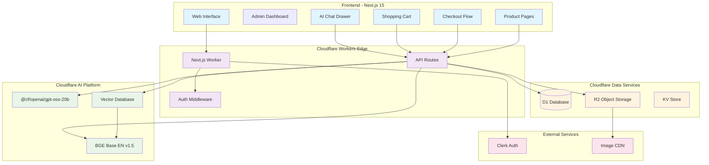
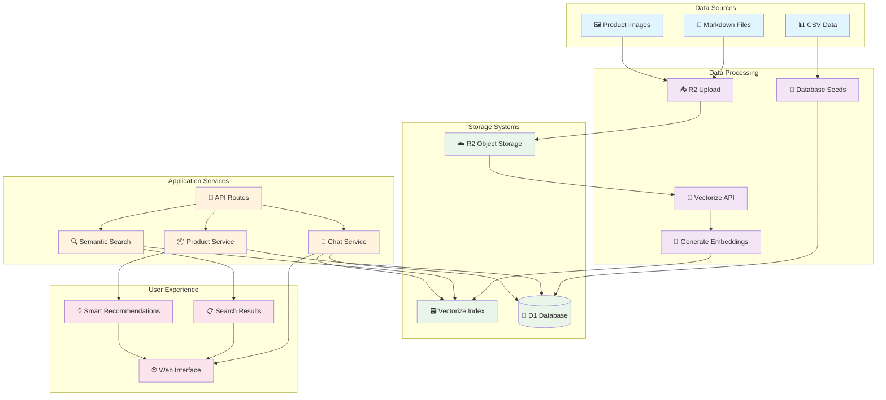
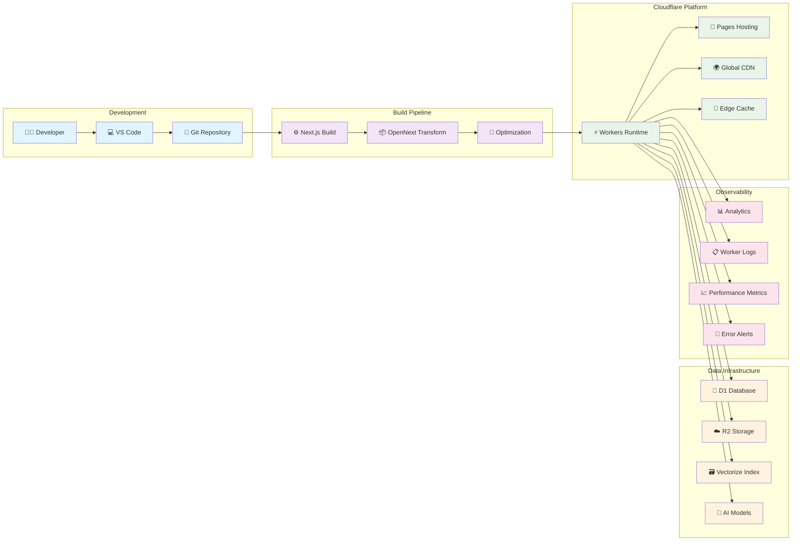

# Mercora Architecture Documentation

System design diagrams for the Mercora AI-powered eCommerce platform: request flow, the AI assistant pipeline, component structure, and the deployment pipeline.

**Status:** Active — descriptive, not decisional; binding rules live in the ADRs it links.

## System Overview

```mermaid
graph TB
    %% User Interface Layer
    subgraph "Frontend - Next.js 15"
        UI[Web Interface]
        Admin[Admin Dashboard]
        Chat[AI Chat Drawer]
        Cart[Shopping Cart]
        Checkout[Checkout Flow]
        Products[Product Pages]
    end

    %% Edge Computing Layer
    subgraph "Cloudflare Workers Edge"
        Worker[Next.js Worker]
        Routes[API Routes]
        Middleware[Auth Middleware]
    end

    %% AI Services Layer
    subgraph "Cloudflare AI Platform"
        LLM["@cf/openai/gpt-oss-20b"]
        Embeddings[BGE Base EN v1.5]
        Vectorize[Vector Database]
    end

    %% Data Layer
    subgraph "Cloudflare Data Services"
        D1[(D1 Database)]
        R2[R2 Object Storage]
        KV[KV Store]
    end

    %% External Services
    subgraph "External Services"
        Clerk[Clerk Auth]
        Images[Image CDN]
    end

    %% Connections
    UI --> Worker
    Chat --> Routes
    Cart --> Routes
    Checkout --> Routes
    Products --> Routes

    Routes --> LLM
    Routes --> Embeddings
    Routes --> Vectorize
    Routes --> D1
    Routes --> R2

    Worker --> Clerk
    Worker --> Middleware

    R2 --> Images
    Vectorize --> Embeddings

    classDef frontend fill:#e1f5fe
    classDef edge fill:#f3e5f5
    classDef ai fill:#e8f5e8
    classDef data fill:#fff3e0
    classDef external fill:#fce4ec

    class UI,Chat,Cart,Checkout,Products frontend
    class Worker,Routes,Middleware edge
    class LLM,Embeddings,Vectorize ai
    class D1,R2,KV data
    class Clerk,Images external
```

## AI Assistant Architecture

```mermaid
graph LR
    %% User Interaction
    User[👤 User] --> ChatUI[💬 Chat Interface]
    
    %% Chat Processing
    ChatUI --> ChatStore[(🗄️ Chat Store)]
    ChatUI --> AgentAPI[🤖 Agent API]
    
    %% AI Processing Pipeline
    AgentAPI --> VectorSearch[🔍 Vector Search]
    VectorSearch --> Embeddings[📊 BGE Embeddings]
    VectorSearch --> VectorDB[(🗃️ Vectorize DB)]
    
    %% Context Retrieval
    VectorDB --> ProductContext[📦 Product Context]
    VectorDB --> KnowledgeContext[📚 Knowledge Context]
    
    %% AI Generation
    ProductContext --> Prompt[📝 Prompt Builder]
    KnowledgeContext --> Prompt
    AgentAPI --> Prompt
    
    Prompt --> LLM["🧠 @cf/openai/gpt-oss-20b"]
    LLM --> Response[💭 AI Response]
    
    %% Product Recommendations
    Response --> ProductIDs[🔢 Product IDs]
    ProductIDs --> Database[(💾 D1 Database)]
    Database --> ProductHydration[🌊 Product Hydration]
    ProductHydration --> FullProducts[📦 Full Products]
    
    %% Return to User
    Response --> ChatUI
    FullProducts --> ChatUI
    ChatUI --> User

    %% Styling
    classDef user fill:#e3f2fd
    classDef ui fill:#f3e5f5
    classDef api fill:#e8f5e8
    classDef ai fill:#fff3e0
    classDef data fill:#fce4ec

    class User user
    class ChatUI,ChatStore ui
    class AgentAPI,VectorSearch,Prompt api
    class Embeddings,VectorDB,LLM,Response ai
    class ProductIDs,Database,ProductHydration,FullProducts data
```

## Data Flow Architecture

```mermaid
flowchart TD
    %% Data Sources
    subgraph "Data Sources"
        MD[📄 Markdown Files]
        CSV[📊 CSV Data]
        Images[🖼️ Product Images]
    end

    %% Processing Pipeline
    subgraph "Data Processing"
        Upload[📤 R2 Upload]
        VectorizeAPI[🔄 Vectorize API]
        Embeddings[🧮 Generate Embeddings]
        DBSeeds[🌱 Database Seeds]
    end

    %% Storage Layer
    subgraph "Storage Systems"
        R2Storage[☁️ R2 Object Storage]
        VectorStore[🗃️ Vectorize Index]
        D1DB[(💾 D1 Database)]
    end

    %% Application Layer
    subgraph "Application Services"
        API[🔌 API Routes]
        Search[🔍 Semantic Search]
        Products[📦 Product Service]
        Chat[💬 Chat Service]
    end

    %% User Interface
    subgraph "User Experience"
        WebUI[🌐 Web Interface]
        Recommendations[💡 Smart Recommendations]
        Results[📋 Search Results]
    end

    %% Data Flow
    MD --> Upload
    CSV --> DBSeeds
    Images --> Upload

    Upload --> R2Storage
    VectorizeAPI --> Embeddings
    Embeddings --> VectorStore
    DBSeeds --> D1DB

    R2Storage --> VectorizeAPI
    
    API --> Search
    API --> Products
    API --> Chat

    Search --> VectorStore
    Products --> D1DB
    Chat --> VectorStore
    Chat --> D1DB

    Search --> Results
    Products --> Recommendations
    Chat --> WebUI

    Results --> WebUI
    Recommendations --> WebUI

    %% Styling
    classDef source fill:#e1f5fe
    classDef process fill:#f3e5f5
    classDef storage fill:#e8f5e8
    classDef service fill:#fff3e0
    classDef ui fill:#fce4ec

    class MD,CSV,Images source
    class Upload,VectorizeAPI,Embeddings,DBSeeds process
    class R2Storage,VectorStore,D1DB storage
    class API,Search,Products,Chat service
    class WebUI,Recommendations,Results ui
```

## Database Schema

The current schema lives in `lib/db/schema/`, and every applied change is a
numbered file in `migrations/`; both are the source of truth, not a diagram
in this document. Migrations are additive-only (expand first, contract
later) — see `docs/database-migrations.md` for the binding rule.

## Component Architecture

```mermaid
graph TB
    %% Application Shell
    subgraph "App Shell"
        Layout[🏗️ Layout Component]
        Header[📱 Header]
        Footer[🦶 Footer]
        Navigation[🧭 Navigation]
    end

    %% Page Components
    subgraph "Page Components"
        HomePage[🏠 Home Page]
        ProductPage[📦 Product Page]
        CategoryPage[📂 Category Page]
        CheckoutPage[💳 Checkout Page]
        OrdersPage[📋 Orders Page]
    end

    %% Feature Components
    subgraph "Feature Components"
        AgentDrawer[🤖 AI Chat Drawer]
        ProductCard[🎴 Product Card]
        CartDrawer[🛒 Cart Drawer]
        ProductRecs[💡 Product Recommendations]
        SearchResults[🔍 Search Results]
    end

    %% UI Components
    subgraph "UI Components (shadcn/ui)"
        Button[🔘 Button]
        Input[📝 Input]
        Card[🎴 Card]
        Sheet[📄 Sheet]
        Dialog[💬 Dialog]
        Select[📋 Select]
    end

    %% State Management
    subgraph "State Management"
        ChatStore[💭 Chat Store]
        CartStore[🛒 Cart Store]
        UserStore[👤 User Store]
    end

    %% External Services
    subgraph "External Integrations"
        ClerkAuth[🔐 Clerk Auth]
        APIRoutes[🔌 API Routes]
        ImageLoader[🖼️ Image Loader]
    end

    %% Component Relationships
    Layout --> Header
    Layout --> Footer
    Layout --> Navigation

    Header --> AgentDrawer
    Header --> CartDrawer

    HomePage --> ProductCard
    ProductPage --> ProductRecs
    CategoryPage --> SearchResults
    CheckoutPage --> CartStore

    AgentDrawer --> ChatStore
    AgentDrawer --> ProductCard
    ProductRecs --> APIRoutes
    CartDrawer --> CartStore

    ProductCard --> Button
    AgentDrawer --> Sheet
    CartDrawer --> Sheet
    ProductCard --> Card

    ChatStore --> APIRoutes
    CartStore --> APIRoutes
    UserStore --> ClerkAuth

    %% Styling
    classDef shell fill:#e1f5fe
    classDef page fill:#f3e5f5
    classDef feature fill:#e8f5e8
    classDef ui fill:#fff3e0
    classDef state fill:#fce4ec
    classDef external fill:#f1f8e9

    class Layout,Header,Footer,Navigation shell
    class HomePage,ProductPage,CategoryPage,CheckoutPage,OrdersPage page
    class AgentDrawer,ProductCard,CartDrawer,ProductRecs,SearchResults feature
    class Button,Input,Card,Sheet,Dialog,Select ui
    class ChatStore,CartStore,UserStore state
    class ClerkAuth,APIRoutes,ImageLoader external
```

## Deployment Pipeline

```mermaid
flowchart LR
    %% Development
    subgraph "Development"
        Dev[👨‍💻 Developer]
        VSCode[💻 VS Code]
        Git[📝 Git Repository]
    end

    %% Build Process
    subgraph "Build Pipeline"
        NextBuild[⚙️ Next.js Build]
        OpenNext[📦 OpenNext Transform]
        Optimize[🔧 Optimization]
    end

    %% Cloudflare Services
    subgraph "Cloudflare Platform"
        Workers[⚡ Workers Runtime]
        Pages[📄 Pages Hosting]
        CDN[🌍 Global CDN]
        EdgeCache[💾 Edge Cache]
    end

    %% Data Services
    subgraph "Data Infrastructure"
        D1Deploy[💾 D1 Database]
        R2Deploy[☁️ R2 Storage]
        VectorDeploy[🗃️ Vectorize Index]
        AIService[🤖 AI Models]
    end

    %% Monitoring
    subgraph "Observability"
        Analytics[📊 Analytics]
        Logs[📋 Worker Logs]
        Metrics[📈 Performance Metrics]
        Alerts[🚨 Error Alerts]
    end

    %% Flow
    Dev --> VSCode
    VSCode --> Git
    Git --> NextBuild

    NextBuild --> OpenNext
    OpenNext --> Optimize
    Optimize --> Workers

    Workers --> Pages
    Workers --> CDN
    Workers --> EdgeCache

    Workers --> D1Deploy
    Workers --> R2Deploy
    Workers --> VectorDeploy
    Workers --> AIService

    Workers --> Analytics
    Workers --> Logs
    Workers --> Metrics
    Workers --> Alerts

    %% Styling
    classDef dev fill:#e1f5fe
    classDef build fill:#f3e5f5
    classDef cf fill:#e8f5e8
    classDef data fill:#fff3e0
    classDef monitor fill:#fce4ec

    class Dev,VSCode,Git dev
    class NextBuild,OpenNext,Optimize build
    class Workers,Pages,CDN,EdgeCache cf
    class D1Deploy,R2Deploy,VectorDeploy,AIService data
    class Analytics,Logs,Metrics,Alerts monitor
```

## Security Architecture

This repository's security surfaces are code, not a diagram: `lib/security-headers.ts`
builds the response Content-Security-Policy and other security headers applied in
`next.config.ts`. Admin authentication and its production-deployment guard are
documented in `docs/admin-authentication.md`. Checkout's server-owned pricing and
payment finalization are documented in `docs/checkout-trust-boundary.md`.

---

*Generated for Mercora AI-Powered eCommerce Platform*
*Architecture documentation maintained in `/docs/architecture.md`*
